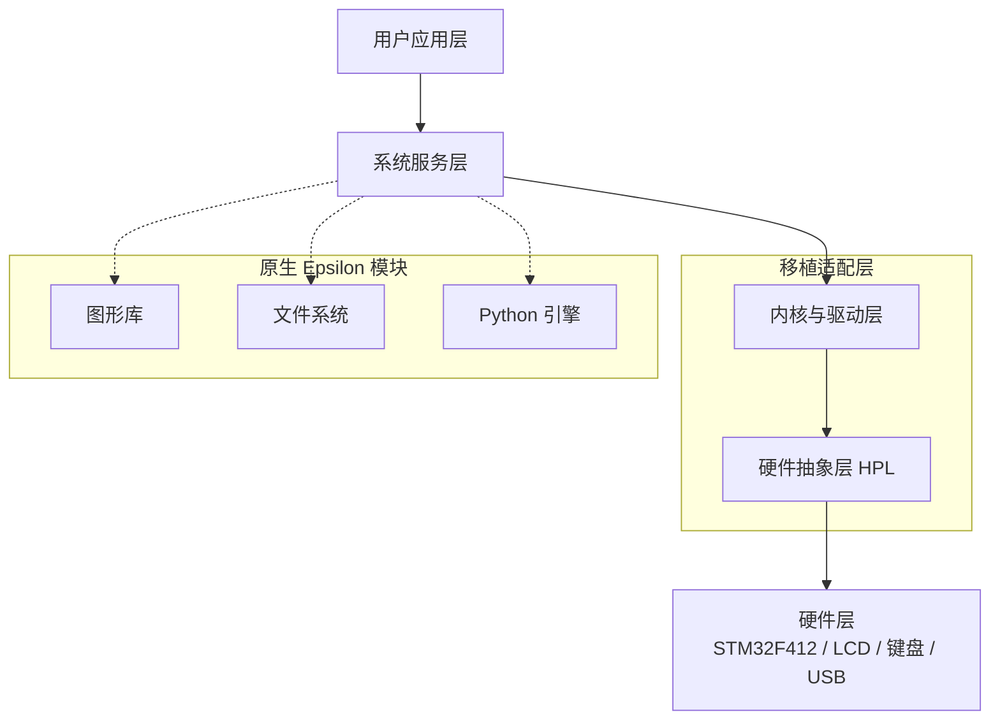
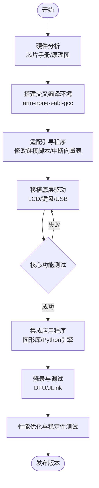

# esp-numworks
This is numworks caculation porting on esp32s3 device

# Numworks 移植项目

[](LICENSE)
[](https://www.numworks.com/)

本项目是针对 Numworks 计算器的系统移植与定制开发，旨在将自定义固件或第三方操作系统移植到 Numworks 硬件平台，并提供完整的构建与烧录工具链。

## 📖 项目简介

Numworks 是一款基于 ARM Cortex-M4 的开源计算器，其硬件设计、操作系统（Epsilon）和配套工具链均开放源代码。本项目在此基础上进行移植开发，支持：

- 自定义内核与应用程序
- 跨平台交叉编译环境
- 一键烧录脚本
- 仿真器调试支持

## 🏗️ 系统架构

下图为移植后的系统软件架构，展示了从硬件抽象层到应用层的模块关系。



## 🔄 移植流程

整个移植过程分为硬件适配、引导加载、系统集成和测试验证四个阶段，具体流程如下：

图表



<svg id="mermaid-svg-18" width="100%" xmlns="http://www.w3.org/2000/svg" class="flowchart mermaid-svg" viewBox="-13.019636535643622 -13.019642257690203 286.43217163085933 1290.0395324707033" role="graphics-document document" height="100%" style="max-width: 100%; display: block; transform-origin: 0px 0px; user-select: none; transform: translate(5.68434e-14px, 6.4931e-07px) scale(1);"><g><marker id="mermaid-svg-18_flowchart-v2-pointEnd" class="marker flowchart-v2" viewBox="0 0 10 10" refX="5" refY="5" markerUnits="userSpaceOnUse" markerWidth="8" markerHeight="8" orient="auto"><path d="M 0 0 L 10 5 L 0 10 z" class="arrowMarkerPath" style="stroke-width: 1; stroke-dasharray: 1, 0;"></path></marker><marker id="mermaid-svg-18_flowchart-v2-pointStart" class="marker flowchart-v2" viewBox="0 0 10 10" refX="4.5" refY="5" markerUnits="userSpaceOnUse" markerWidth="8" markerHeight="8" orient="auto"><path d="M 0 5 L 10 10 L 10 0 z" class="arrowMarkerPath" style="stroke-width: 1; stroke-dasharray: 1, 0;"></path></marker><marker id="mermaid-svg-18_flowchart-v2-circleEnd" class="marker flowchart-v2" viewBox="0 0 10 10" refX="11" refY="5" markerUnits="userSpaceOnUse" markerWidth="11" markerHeight="11" orient="auto"><circle cx="5" cy="5" r="5" class="arrowMarkerPath" style="stroke-width: 1; stroke-dasharray: 1, 0;"></circle></marker><marker id="mermaid-svg-18_flowchart-v2-circleStart" class="marker flowchart-v2" viewBox="0 0 10 10" refX="-1" refY="5" markerUnits="userSpaceOnUse" markerWidth="11" markerHeight="11" orient="auto"><circle cx="5" cy="5" r="5" class="arrowMarkerPath" style="stroke-width: 1; stroke-dasharray: 1, 0;"></circle></marker><marker id="mermaid-svg-18_flowchart-v2-crossEnd" class="marker cross flowchart-v2" viewBox="0 0 11 11" refX="12" refY="5.2" markerUnits="userSpaceOnUse" markerWidth="11" markerHeight="11" orient="auto"><path d="M 1,1 l 9,9 M 10,1 l -9,9" class="arrowMarkerPath" style="stroke-width: 2; stroke-dasharray: 1, 0;"></path></marker><marker id="mermaid-svg-18_flowchart-v2-crossStart" class="marker cross flowchart-v2" viewBox="0 0 11 11" refX="-1" refY="5.2" markerUnits="userSpaceOnUse" markerWidth="11" markerHeight="11" orient="auto"><path d="M 1,1 l 9,9 M 10,1 l -9,9" class="arrowMarkerPath" style="stroke-width: 2; stroke-dasharray: 1, 0;"></path></marker><g class="root"><g class="clusters"></g><g class="edgePaths"><path d="M130.696,47.5L130.613,51.583C130.53,55.667,130.363,63.833,130.28,71.417C130.196,79,130.196,86,130.196,89.5L130.196,93" id="L_Start_Step1_0" class="edge-thickness-normal edge-pattern-solid edge-thickness-normal edge-pattern-solid flowchart-link" style="" marker-end="url(#mermaid-svg-18_flowchart-v2-pointEnd)"></path><path d="M130.196,175L130.196,179.167C130.196,183.333,130.196,191.667,130.196,199.333C130.196,207,130.196,214,130.196,217.5L130.196,221" id="L_Step1_Step2_0" class="edge-thickness-normal edge-pattern-solid edge-thickness-normal edge-pattern-solid flowchart-link" style="" marker-end="url(#mermaid-svg-18_flowchart-v2-pointEnd)"></path><path d="M130.196,303L130.196,307.167C130.196,311.333,130.196,319.667,130.196,327.333C130.196,335,130.196,342,130.196,345.5L130.196,349" id="L_Step2_Step3_0" class="edge-thickness-normal edge-pattern-solid edge-thickness-normal edge-pattern-solid flowchart-link" style="" marker-end="url(#mermaid-svg-18_flowchart-v2-pointEnd)"></path><path d="M130.196,431L130.196,435.167C130.196,439.333,130.196,447.667,130.196,455.333C130.196,463,130.196,470,130.196,473.5L130.196,477" id="L_Step3_Step4_0" class="edge-thickness-normal edge-pattern-solid edge-thickness-normal edge-pattern-solid flowchart-link" style="" marker-end="url(#mermaid-svg-18_flowchart-v2-pointEnd)"></path><path d="M120.96,559L119.499,565.167C118.039,571.333,115.117,583.667,114.898,597.157C114.679,610.647,117.161,625.294,118.402,632.617L119.643,639.941" id="L_Step4_Step5_0" class="edge-thickness-normal edge-pattern-solid edge-thickness-normal edge-pattern-solid flowchart-link" style="" marker-end="url(#mermaid-svg-18_flowchart-v2-pointEnd)"></path><path d="M141.081,643.885L142.267,635.904C143.453,627.923,145.825,611.962,145.704,598.463C145.583,584.964,142.969,573.928,141.662,568.41L140.355,562.892" id="L_Step5_Step4_0" class="edge-thickness-normal edge-pattern-solid edge-thickness-normal edge-pattern-solid flowchart-link" style="" marker-end="url(#mermaid-svg-18_flowchart-v2-pointEnd)"></path><path d="M130.696,783.5L130.613,789.583C130.53,795.667,130.363,807.833,130.28,819.417C130.196,831,130.196,842,130.196,847.5L130.196,853" id="L_Step5_Step6_0" class="edge-thickness-normal edge-pattern-solid edge-thickness-normal edge-pattern-solid flowchart-link" style="" marker-end="url(#mermaid-svg-18_flowchart-v2-pointEnd)"></path><path d="M130.196,935L130.196,939.167C130.196,943.333,130.196,951.667,130.196,959.333C130.196,967,130.196,974,130.196,977.5L130.196,981" id="L_Step6_Step7_0" class="edge-thickness-normal edge-pattern-solid edge-thickness-normal edge-pattern-solid flowchart-link" style="" marker-end="url(#mermaid-svg-18_flowchart-v2-pointEnd)"></path><path d="M130.196,1063L130.196,1067.167C130.196,1071.333,130.196,1079.667,130.196,1087.333C130.196,1095,130.196,1102,130.196,1105.5L130.196,1109" id="L_Step7_Step8_0" class="edge-thickness-normal edge-pattern-solid edge-thickness-normal edge-pattern-solid flowchart-link" style="" marker-end="url(#mermaid-svg-18_flowchart-v2-pointEnd)"></path><path d="M130.196,1167L130.196,1171.167C130.196,1175.333,130.196,1183.667,130.267,1191.417C130.337,1199.167,130.477,1206.334,130.548,1209.917L130.618,1213.501" id="L_Step8_End_0" class="edge-thickness-normal edge-pattern-solid edge-thickness-normal edge-pattern-solid flowchart-link" style="" marker-end="url(#mermaid-svg-18_flowchart-v2-pointEnd)"></path></g><g class="edgeLabels"><g class="edgeLabel"><g class="label" transform="translate(0, 0)"><foreignObject width="0" height="0"><div xmlns="http://www.w3.org/1999/xhtml" class="labelBkg" style="background-color: rgba(232, 232, 232, 0.5); display: table-cell; white-space: nowrap; line-height: 1.5; max-width: 200px; text-align: center;"><span class="edgeLabel" style="fill: rgb(51, 51, 51); color: rgb(51, 51, 51); background-color: rgba(232, 232, 232, 0.8); text-align: center;"></span></div></foreignObject></g></g><g class="edgeLabel"><g class="label" transform="translate(0, 0)"><foreignObject width="0" height="0"><div xmlns="http://www.w3.org/1999/xhtml" class="labelBkg" style="background-color: rgba(232, 232, 232, 0.5); display: table-cell; white-space: nowrap; line-height: 1.5; max-width: 200px; text-align: center;"><span class="edgeLabel" style="fill: rgb(51, 51, 51); color: rgb(51, 51, 51); background-color: rgba(232, 232, 232, 0.8); text-align: center;"></span></div></foreignObject></g></g><g class="edgeLabel"><g class="label" transform="translate(0, 0)"><foreignObject width="0" height="0"><div xmlns="http://www.w3.org/1999/xhtml" class="labelBkg" style="background-color: rgba(232, 232, 232, 0.5); display: table-cell; white-space: nowrap; line-height: 1.5; max-width: 200px; text-align: center;"><span class="edgeLabel" style="fill: rgb(51, 51, 51); color: rgb(51, 51, 51); background-color: rgba(232, 232, 232, 0.8); text-align: center;"></span></div></foreignObject></g></g><g class="edgeLabel"><g class="label" transform="translate(0, 0)"><foreignObject width="0" height="0"><div xmlns="http://www.w3.org/1999/xhtml" class="labelBkg" style="background-color: rgba(232, 232, 232, 0.5); display: table-cell; white-space: nowrap; line-height: 1.5; max-width: 200px; text-align: center;"><span class="edgeLabel" style="fill: rgb(51, 51, 51); color: rgb(51, 51, 51); background-color: rgba(232, 232, 232, 0.8); text-align: center;"></span></div></foreignObject></g></g><g class="edgeLabel"><g class="label" transform="translate(0, 0)"><foreignObject width="0" height="0"><div xmlns="http://www.w3.org/1999/xhtml" class="labelBkg" style="background-color: rgba(232, 232, 232, 0.5); display: table-cell; white-space: nowrap; line-height: 1.5; max-width: 200px; text-align: center;"><span class="edgeLabel" style="fill: rgb(51, 51, 51); color: rgb(51, 51, 51); background-color: rgba(232, 232, 232, 0.8); text-align: center;"></span></div></foreignObject></g></g><g class="edgeLabel" transform="translate(147.43311, 601.13703)"><g class="label" transform="translate(-16, -12.000001907348633)"><foreignObject width="32" height="24.000003814697266"><div xmlns="http://www.w3.org/1999/xhtml" class="labelBkg" style="background-color: rgba(232, 232, 232, 0.5); display: table-cell; white-space: nowrap; line-height: 1.5; max-width: 200px; text-align: center;"><span class="edgeLabel" style="fill: rgb(51, 51, 51); color: rgb(51, 51, 51); background-color: rgba(232, 232, 232, 0.8); text-align: center;"><p style="margin: 0px; background-color: rgba(232, 232, 232, 0.8);">失败</p></span></div></foreignObject></g></g><g class="edgeLabel" transform="translate(130.1964340209961, 820.0000553131104)"><g class="label" transform="translate(-16, -12.000001907348633)"><foreignObject width="32" height="24.000003814697266"><div xmlns="http://www.w3.org/1999/xhtml" class="labelBkg" style="background-color: rgba(232, 232, 232, 0.5); display: table-cell; white-space: nowrap; line-height: 1.5; max-width: 200px; text-align: center;"><span class="edgeLabel" style="fill: rgb(51, 51, 51); color: rgb(51, 51, 51); background-color: rgba(232, 232, 232, 0.8); text-align: center;"><p style="margin: 0px; background-color: rgba(232, 232, 232, 0.8);">成功</p></span></div></foreignObject></g></g><g class="edgeLabel"><g class="label" transform="translate(0, 0)"><foreignObject width="0" height="0"><div xmlns="http://www.w3.org/1999/xhtml" class="labelBkg" style="background-color: rgba(232, 232, 232, 0.5); display: table-cell; white-space: nowrap; line-height: 1.5; max-width: 200px; text-align: center;"><span class="edgeLabel" style="fill: rgb(51, 51, 51); color: rgb(51, 51, 51); background-color: rgba(232, 232, 232, 0.8); text-align: center;"></span></div></foreignObject></g></g><g class="edgeLabel"><g class="label" transform="translate(0, 0)"><foreignObject width="0" height="0"><div xmlns="http://www.w3.org/1999/xhtml" class="labelBkg" style="background-color: rgba(232, 232, 232, 0.5); display: table-cell; white-space: nowrap; line-height: 1.5; max-width: 200px; text-align: center;"><span class="edgeLabel" style="fill: rgb(51, 51, 51); color: rgb(51, 51, 51); background-color: rgba(232, 232, 232, 0.8); text-align: center;"></span></div></foreignObject></g></g><g class="edgeLabel"><g class="label" transform="translate(0, 0)"><foreignObject width="0" height="0"><div xmlns="http://www.w3.org/1999/xhtml" class="labelBkg" style="background-color: rgba(232, 232, 232, 0.5); display: table-cell; white-space: nowrap; line-height: 1.5; max-width: 200px; text-align: center;"><span class="edgeLabel" style="fill: rgb(51, 51, 51); color: rgb(51, 51, 51); background-color: rgba(232, 232, 232, 0.8); text-align: center;"></span></div></foreignObject></g></g></g><g class="nodes"><g class="node default" id="flowchart-Start-0" transform="translate(130.1964340209961, 27.500001907348633)"><g class="basic label-container outer-path"><path d="M-8.874998569488525 -19.500001907348633 C-2.4241020528195625 -19.500001907348633, 4.0267944638494 -19.500001907348633, 8.874998569488525 -19.500001907348633 C8.874998569488525 -19.500001907348633, 8.874998569488524 -19.500001907348633, 8.874998569488524 -19.500001907348633 C9.217096206940619 -19.4890315019682, 9.559193844392714 -19.47806109658777, 10.124367981316672 -19.45993706206134 C10.442821801464955 -19.42921620502839, 10.761275621613237 -19.398495347995436, 11.36860346624272 -19.33990716124263 C11.679692200673362 -19.28961274718905, 11.990780935104002 -19.23931833313547, 12.602592193771432 -19.140405433501293 C12.95352541687923 -19.060307215380234, 13.304458639987029 -18.980208997259176, 13.82126343953164 -18.862251674229608 C14.113618019270433 -18.77548236956364, 14.405972599009226 -18.68871306489767, 15.019609421970358 -18.50658887688822 C15.284992984953599 -18.408925272531622, 15.550376547936839 -18.311261668175025, 16.192705880401327 -18.074878536200835 C16.49320561579046 -17.941856217352, 16.79370535117959 -17.80883389850317, 17.335732309848463 -17.568894642558913 C17.77156647197008 -17.341520239345172, 18.207400634091695 -17.114145836131428, 18.44399176953476 -16.990716392314635 C18.657899022741557 -16.861044558362124, 18.871806275948355 -16.731372724409614, 19.51293018361947 -16.342719643917096 C19.74395076340175 -16.181569688180694, 19.974971343184023 -16.020419732444292, 20.53815505487254 -15.62756715500033 C20.851841080220936 -15.377410897320692, 21.165527105569332 -15.127254639641055, 21.51545351438794 -14.84819764054103 C21.78290389902405 -14.60530627756392, 22.05035428366016 -14.362414914586813, 22.44080963316567 -14.00781369704834 C22.7176975307117 -13.721904209912902, 22.99458542825773 -13.435994722777465, 23.3104209244254 -13.109868642407866 C23.55733628419515 -12.819827810940332, 23.8042516439649 -12.529786979472796, 24.120713968840313 -12.158052325457726 C24.386907451511647 -11.801377309403298, 24.653100934182977 -11.444702293348868, 24.868359098483587 -11.156275963608243 C25.121567131883623 -10.767280428428503, 25.374775165283655 -10.378284893248763, 25.550284079148152 -10.108656070810596 C25.702255477574273 -9.838815464132228, 25.854226876000396 -9.568974857453858, 26.163686734816004 -9.019497541918064 C26.37084203188688 -8.58933513513709, 26.577997328957753 -8.159172728356117, 26.706046462400533 -7.89327596294964 C26.889296355599935 -7.44064518385145, 27.072546248799338 -6.98801440475326, 27.17513458944531 -6.7346192199470725 C27.268610679003352 -6.453084131590564, 27.362086768561394 -6.171549043234055, 27.569023532217226 -5.5482884819984415 C27.63288569847241 -5.304754364029484, 27.696747864727595 -5.061220246060527, 27.886094716561505 -4.339158636573132 C27.972900417440083 -3.8934297089530165, 28.05970611831866 -3.4477007813329013, 28.125045228970126 -3.1121982575635436 C28.174690041805516 -2.7271628926894, 28.224334854640908 -2.3421275278152565, 28.284893170532882 -1.872449188349185 C28.30433538292837 -1.5696210368180479, 28.32377759532386 -1.266792885286911, 28.36498169177061 -0.6250058237808084 C28.36498169177061 -0.2897289907729924, 28.36498169177061 0.045547842234823555, 28.36498169177061 0.6250058237808036 C28.340360422293404 1.008501969819283, 28.3157391528162 1.3919981158577621, 28.284893170532882 1.8724491883491718 C28.243819930576805 2.191005126619892, 28.202746690620724 2.509561064890612, 28.12504522897013 3.1121982575635303 C28.07260880074211 3.3814482340713776, 28.02017237251409 3.650698210579225, 27.886094716561505 4.339158636573128 C27.781700087983523 4.737260600259205, 27.67730545940554 5.135362563945281, 27.569023532217226 5.548288481998428 C27.41993041431148 5.997333198368165, 27.27083729640573 6.446377914737901, 27.175134589445317 6.734619219947059 C27.030084781508258 7.09289504989886, 26.885034973571194 7.451170879850659, 26.706046462400536 7.893275962949635 C26.59054674674219 8.133113593812206, 26.47504703108385 8.372951224674777, 26.163686734816004 9.019497541918058 C26.018579732409318 9.27714971836845, 25.873472730002632 9.534801894818843, 25.550284079148156 10.108656070810593 C25.36266314850367 10.396892203554724, 25.175042217859186 10.685128336298856, 24.868359098483598 11.156275963608232 C24.64910967152984 11.450050221692567, 24.429860244576084 11.743824479776904, 24.12071396884032 12.158052325457723 C23.83729971870156 12.490966830398396, 23.553885468562797 12.823881335339067, 23.310420924425408 13.109868642407855 C23.128382109687966 13.297838664288907, 22.946343294950523 13.485808686169957, 22.440809633165678 14.007813697048334 C22.150352396535915 14.271599274278135, 21.85989515990615 14.535384851507935, 21.515453514387957 14.848197640541018 C21.180437753196312 15.11536379494754, 20.845421992004663 15.38252994935406, 20.538155054872544 15.627567155000328 C20.276561575622914 15.810043441925666, 20.014968096373288 15.992519728851006, 19.51293018361948 16.34271964391709 C19.1522917569998 16.561340777480577, 18.79165333038012 16.779961911044065, 18.44399176953476 16.99071639231463 C18.182621466591698 17.12707311194436, 17.921251163648634 17.263429831574086, 17.335732309848467 17.56889464255891 C16.920368370574533 17.752763937142, 16.505004431300602 17.93663323172509, 16.192705880401338 18.07487853620083 C15.791907139084216 18.222376177948483, 15.391108397767093 18.369873819696135, 15.019609421970369 18.506588876888216 C14.717859304965298 18.596146727696635, 14.416109187960227 18.685704578505053, 13.821263439531661 18.862251674229604 C13.436306598014696 18.950115561227694, 13.051349756497729 19.037979448225787, 12.60259219377144 19.14040543350129 C12.305794953906315 19.188389309545713, 12.008997714041191 19.236373185590136, 11.368603466242734 19.339907161242625 C11.041457947591631 19.371466495976847, 10.71431242894053 19.40302583071107, 10.124367981316672 19.45993706206134 C9.725733084233719 19.47272050731503, 9.327098187150765 19.485503952568727, 8.874998569488529 19.500001907348633 C8.874998569488527 19.500001907348633, 8.874998569488527 19.500001907348633, 8.874998569488525 19.500001907348633 C3.114798527704532 19.500001907348633, -2.6454015140794613 19.500001907348633, -8.874998569488522 19.500001907348633 C-9.221471581564535 19.488891192220162, -9.567944593640547 19.47778047709169, -10.124367981316665 19.45993706206134 C-10.564974133709523 19.417432316446426, -11.005580286102383 19.374927570831513, -11.368603466242725 19.339907161242625 C-11.6917482365702 19.2876636208012, -12.014893006897676 19.235420080359773, -12.602592193771432 19.14040543350129 C-12.902350115347105 19.07198764400489, -13.202108036922777 19.003569854508488, -13.821263439531638 18.862251674229608 C-14.289411852198931 18.72330768271112, -14.757560264866223 18.58436369119263, -15.019609421970348 18.506588876888223 C-15.291454947326386 18.406547210644714, -15.563300472682423 18.3065055444012, -16.19270588040133 18.074878536200835 C-16.49388375831253 17.941556023773863, -16.795061636223732 17.808233511346895, -17.33573230984846 17.568894642558913 C-17.607839129951603 17.426936688803842, -17.879945950054747 17.284978735048767, -18.443991769534758 16.99071639231464 C-18.835524279155106 16.75336708408236, -19.227056788775453 16.51601777585008, -19.51293018361946 16.3427196439171 C-19.74015185542507 16.184219641933147, -19.967373527230674 16.025719639949198, -20.53815505487254 15.627567155000332 C-20.86295336931094 15.368549142481848, -21.187751683749337 15.109531129963365, -21.51545351438794 14.848197640541033 C-21.87034909588344 14.525890863449348, -22.225244677378942 14.203584086357662, -22.440809633165664 14.007813697048348 C-22.661575611818172 13.779854698865703, -22.88234159047068 13.55189570068306, -23.310420924425408 13.10986864240786 C-23.550893935602495 12.827395360177286, -23.791366946779583 12.544922077946712, -24.120713968840313 12.158052325457728 C-24.34933567643501 11.851720065146866, -24.57795738402971 11.545387804836002, -24.868359098483587 11.156275963608245 C-25.040592271658976 10.891679558528086, -25.21282544483437 10.627083153447927, -25.55028407914815 10.108656070810605 C-25.705174987356948 9.83363157888067, -25.860065895565747 9.558607086950735, -26.163686734816 9.019497541918065 C-26.354344439240066 8.623592739260129, -26.54500214366413 8.227687936602193, -26.706046462400533 7.893275962949643 C-26.84692510163391 7.545303000340001, -26.98780374086729 7.197330037730358, -27.17513458944531 6.734619219947074 C-27.28314049383451 6.4093226443307305, -27.391146398223704 6.084026068714387, -27.569023532217226 5.548288481998436 C-27.644528688543463 5.260354596784735, -27.720033844869704 4.972420711571035, -27.886094716561505 4.339158636573135 C-27.9431699587507 4.0460893307883214, -28.000245200939897 3.753020025003508, -28.125045228970126 3.112198257563546 C-28.171141096651052 2.754687810488931, -28.21723696433198 2.397177363414317, -28.28489317053288 1.872449188349196 C-28.30814373599985 1.5103028636825175, -28.331394301466815 1.1481565390158393, -28.36498169177061 0.6250058237808108 C-28.36498169177061 0.3104957436263856, -28.36498169177061 -0.004014336528039619, -28.36498169177061 -0.6250058237808014 C-28.345660196605404 -0.9259537070090733, -28.326338701440196 -1.2269015902373452, -28.284893170532882 -1.8724491883491694 C-28.24160215789783 -2.2082057335692715, -28.198311145262775 -2.5439622787893734, -28.12504522897013 -3.1121982575635365 C-28.062425885264194 -3.43373535289053, -27.99980654155826 -3.7552724482175233, -27.886094716561505 -4.339158636573125 C-27.810316955509887 -4.628132081752341, -27.734539194458268 -4.917105526931556, -27.56902353221723 -5.548288481998426 C-27.420396860320302 -5.995928337307669, -27.27177018842338 -6.443568192616912, -27.17513458944532 -6.734619219947049 C-27.069444925522443 -6.9956747332072, -26.963755261599566 -7.256730246467351, -26.706046462400536 -7.893275962949633 C-26.587720944117628 -8.138981433424608, -26.469395425834715 -8.384686903899581, -26.163686734816004 -9.019497541918057 C-26.003780510496174 -9.303427235458956, -25.843874286176344 -9.587356928999856, -25.550284079148152 -10.1086560708106 C-25.3585662208104 -10.403186184670716, -25.166848362472646 -10.697716298530832, -24.868359098483594 -11.156275963608238 C-24.592108750909556 -11.52642626243305, -24.315858403335522 -11.896576561257863, -24.12071396884032 -12.158052325457723 C-23.88367760463948 -12.436488726599244, -23.64664124043864 -12.714925127740763, -23.31042092442541 -13.109868642407855 C-23.056794624753234 -13.371758619925838, -22.803168325081057 -13.633648597443823, -22.440809633165685 -14.007813697048329 C-22.080385615183403 -14.335141253882894, -21.71996159720112 -14.66246881071746, -21.515453514387957 -14.848197640541017 C-21.277293807148858 -15.038123669368222, -21.03913409990976 -15.228049698195429, -20.538155054872547 -15.627567155000326 C-20.236582020132616 -15.837931449148636, -19.935008985392685 -16.048295743296944, -19.512930183619485 -16.342719643917086 C-19.16946233665723 -16.55093187118672, -18.82599448969497 -16.759144098456353, -18.44399176953477 -16.99071639231463 C-18.060231132392847 -17.19092407090115, -17.67647049525093 -17.39113174948767, -17.33573230984847 -17.56889464255891 C-16.92329648257359 -17.751467748819376, -16.51086065529871 -17.93404085507984, -16.19270588040134 -18.07487853620083 C-15.770343686785495 -18.230311727724782, -15.347981493169646 -18.385744919248733, -15.019609421970372 -18.506588876888216 C-14.599386384515082 -18.63130886860921, -14.179163347059793 -18.756028860330204, -13.821263439531663 -18.8622516742296 C-13.491924580544772 -18.937421119656456, -13.162585721557884 -19.012590565083315, -12.602592193771443 -19.14040543350129 C-12.150702556934675 -19.213463445528586, -11.698812920097907 -19.28652145755588, -11.368603466242735 -19.339907161242625 C-10.940651100483196 -19.381191211279425, -10.512698734723656 -19.42247526131623, -10.124367981316675 -19.45993706206134 C-9.757968423641602 -19.471686782722504, -9.391568865966526 -19.48343650338367, -8.87499856948853 -19.500001907348633 C-8.874998569488529 -19.500001907348633, -8.874998569488527 -19.500001907348633, -8.874998569488525 -19.500001907348633" stroke="none" stroke-width="0" fill="#ECECFF" style=""></path><path d="M-8.874998569488525 -19.500001907348633 C-4.010535716377182 -19.500001907348633, 0.8539271367341605 -19.500001907348633, 8.874998569488525 -19.500001907348633 M-8.874998569488525 -19.500001907348633 C-5.1616510848765875 -19.500001907348633, -1.4483036002646497 -19.500001907348633, 8.874998569488525 -19.500001907348633 M8.874998569488525 -19.500001907348633 C8.874998569488525 -19.500001907348633, 8.874998569488524 -19.500001907348633, 8.874998569488524 -19.500001907348633 M8.874998569488525 -19.500001907348633 C8.874998569488525 -19.500001907348633, 8.874998569488524 -19.500001907348633, 8.874998569488524 -19.500001907348633 M8.874998569488524 -19.500001907348633 C9.157210939327056 -19.490951905940964, 9.439423309165587 -19.4819019045333, 10.124367981316672 -19.45993706206134 M8.874998569488524 -19.500001907348633 C9.280191520937112 -19.48700815805591, 9.685384472385701 -19.47401440876319, 10.124367981316672 -19.45993706206134 M10.124367981316672 -19.45993706206134 C10.39319764322625 -19.434003387891895, 10.662027305135828 -19.408069713722448, 11.36860346624272 -19.33990716124263 M10.124367981316672 -19.45993706206134 C10.450153473994492 -19.42850892739709, 10.775938966672312 -19.39708079273284, 11.36860346624272 -19.33990716124263 M11.36860346624272 -19.33990716124263 C11.776452158231162 -19.27396934763578, 12.184300850219604 -19.208031534028937, 12.602592193771432 -19.140405433501293 M11.36860346624272 -19.33990716124263 C11.618304442045606 -19.299537443934806, 11.868005417848492 -19.259167726626984, 12.602592193771432 -19.140405433501293 M12.602592193771432 -19.140405433501293 C12.969125259551944 -19.056746653088673, 13.335658325332455 -18.973087872676057, 13.82126343953164 -18.862251674229608 M12.602592193771432 -19.140405433501293 C12.861009949781257 -19.081423267025503, 13.119427705791082 -19.022441100549713, 13.82126343953164 -18.862251674229608 M13.82126343953164 -18.862251674229608 C14.179314465067947 -18.75598400929862, 14.537365490604255 -18.649716344367626, 15.019609421970358 -18.50658887688822 M13.82126343953164 -18.862251674229608 C14.176512310295053 -18.7568156741264, 14.531761181058465 -18.651379674023197, 15.019609421970358 -18.50658887688822 M15.019609421970358 -18.50658887688822 C15.41943721837529 -18.35944855184357, 15.819265014780221 -18.21230822679892, 16.192705880401327 -18.074878536200835 M15.019609421970358 -18.50658887688822 C15.40123833018406 -18.366145910926623, 15.782867238397763 -18.225702944965022, 16.192705880401327 -18.074878536200835 M16.192705880401327 -18.074878536200835 C16.50413950497116 -17.937016108954005, 16.81557312954099 -17.799153681707175, 17.335732309848463 -17.568894642558913 M16.192705880401327 -18.074878536200835 C16.615604156556874 -17.88767401417842, 17.038502432712416 -17.700469492156003, 17.335732309848463 -17.568894642558913 M17.335732309848463 -17.568894642558913 C17.56519866484644 -17.449182192136682, 17.79466501984442 -17.329469741714455, 18.44399176953476 -16.990716392314635 M17.335732309848463 -17.568894642558913 C17.632964683415732 -17.41382870365529, 17.930197056983005 -17.258762764751665, 18.44399176953476 -16.990716392314635 M18.44399176953476 -16.990716392314635 C18.809601811528374 -16.769081436295014, 19.175211853521986 -16.54744648027539, 19.51293018361947 -16.342719643917096 M18.44399176953476 -16.990716392314635 C18.71204448780487 -16.82822125924667, 18.980097206074984 -16.665726126178708, 19.51293018361947 -16.342719643917096 M19.51293018361947 -16.342719643917096 C19.78150563804464 -16.155373033354135, 20.050081092469803 -15.968026422791176, 20.53815505487254 -15.62756715500033 M19.51293018361947 -16.342719643917096 C19.786672381587834 -16.151768936723126, 20.0604145795562 -15.960818229529153, 20.53815505487254 -15.62756715500033 M20.53815505487254 -15.62756715500033 C20.734254799611772 -15.471182827004158, 20.930354544351008 -15.314798499007988, 21.51545351438794 -14.84819764054103 M20.53815505487254 -15.62756715500033 C20.79229124982047 -15.424900302377527, 21.046427444768398 -15.222233449754722, 21.51545351438794 -14.84819764054103 M21.51545351438794 -14.84819764054103 C21.836137321258615 -14.55696109196966, 22.15682112812929 -14.265724543398287, 22.44080963316567 -14.00781369704834 M21.51545351438794 -14.84819764054103 C21.77000172444389 -14.617023691144789, 22.02454993449984 -14.385849741748547, 22.44080963316567 -14.00781369704834 M22.44080963316567 -14.00781369704834 C22.733686201126012 -13.705394595015871, 23.026562769086354 -13.402975492983403, 23.3104209244254 -13.109868642407866 M22.44080963316567 -14.00781369704834 C22.634078211868015 -13.80824802189276, 22.827346790570356 -13.608682346737183, 23.3104209244254 -13.109868642407866 M23.3104209244254 -13.109868642407866 C23.549729706168662 -12.828762930316794, 23.789038487911924 -12.547657218225721, 24.120713968840313 -12.158052325457726 M23.3104209244254 -13.109868642407866 C23.565996079652262 -12.809655522440085, 23.821571234879126 -12.509442402472304, 24.120713968840313 -12.158052325457726 M24.120713968840313 -12.158052325457726 C24.324044236670648 -11.885608290333545, 24.527374504500987 -11.613164255209364, 24.868359098483587 -11.156275963608243 M24.120713968840313 -12.158052325457726 C24.27879776484593 -11.946234440540287, 24.436881560851546 -11.734416555622849, 24.868359098483587 -11.156275963608243 M24.868359098483587 -11.156275963608243 C25.12969145030289 -10.754799293651544, 25.391023802122195 -10.353322623694847, 25.550284079148152 -10.108656070810596 M24.868359098483587 -11.156275963608243 C25.010692474288934 -10.93761367650826, 25.15302585009428 -10.718951389408279, 25.550284079148152 -10.108656070810596 M25.550284079148152 -10.108656070810596 C25.676013083311346 -9.885411492476626, 25.80174208747454 -9.662166914142654, 26.163686734816004 -9.019497541918064 M25.550284079148152 -10.108656070810596 C25.734859221337384 -9.78092421559377, 25.919434363526616 -9.453192360376942, 26.163686734816004 -9.019497541918064 M26.163686734816004 -9.019497541918064 C26.34309285742425 -8.646956889645956, 26.5224989800325 -8.27441623737385, 26.706046462400533 -7.89327596294964 M26.163686734816004 -9.019497541918064 C26.30863915159153 -8.718500746998805, 26.453591568367063 -8.417503952079548, 26.706046462400533 -7.89327596294964 M26.706046462400533 -7.89327596294964 C26.80982258753558 -7.636946927491178, 26.913598712670634 -7.380617892032715, 27.17513458944531 -6.7346192199470725 M26.706046462400533 -7.89327596294964 C26.87310079299773 -7.4806485365988, 27.04015512359493 -7.068021110247959, 27.17513458944531 -6.7346192199470725 M27.17513458944531 -6.7346192199470725 C27.28778510913534 -6.395333803063577, 27.400435628825367 -6.056048386180082, 27.569023532217226 -5.5482884819984415 M27.17513458944531 -6.7346192199470725 C27.28171797955595 -6.413607030690877, 27.38830136966659 -6.092594841434681, 27.569023532217226 -5.5482884819984415 M27.569023532217226 -5.5482884819984415 C27.640377262803625 -5.276185782370046, 27.711730993390024 -5.0040830827416505, 27.886094716561505 -4.339158636573132 M27.569023532217226 -5.5482884819984415 C27.664779997508386 -5.1831275787286595, 27.76053646279955 -4.817966675458878, 27.886094716561505 -4.339158636573132 M27.886094716561505 -4.339158636573132 C27.941880255375096 -4.052711685043151, 27.997665794188684 -3.766264733513169, 28.125045228970126 -3.1121982575635436 M27.886094716561505 -4.339158636573132 C27.955873696965654 -3.9808583199905545, 28.025652677369806 -3.6225580034079767, 28.125045228970126 -3.1121982575635436 M28.125045228970126 -3.1121982575635436 C28.180665386680925 -2.680819297801059, 28.23628554439172 -2.249440338038574, 28.284893170532882 -1.872449188349185 M28.125045228970126 -3.1121982575635436 C28.166677563558128 -2.789306091733367, 28.208309898146126 -2.4664139259031903, 28.284893170532882 -1.872449188349185 M28.284893170532882 -1.872449188349185 C28.31511079691243 -1.4017852662587307, 28.345328423291978 -0.9311213441682765, 28.36498169177061 -0.6250058237808084 M28.284893170532882 -1.872449188349185 C28.314389405079073 -1.4130215263602923, 28.34388563962526 -0.9535938643713999, 28.36498169177061 -0.6250058237808084 M28.36498169177061 -0.6250058237808084 C28.36498169177061 -0.31545105109346633, 28.36498169177061 -0.005896278406124278, 28.36498169177061 0.6250058237808036 M28.36498169177061 -0.6250058237808084 C28.36498169177061 -0.23776035317864563, 28.36498169177061 0.1494851174235171, 28.36498169177061 0.6250058237808036 M28.36498169177061 0.6250058237808036 C28.348594004756983 0.8802572769208951, 28.332206317743356 1.1355087300609865, 28.284893170532882 1.8724491883491718 M28.36498169177061 0.6250058237808036 C28.337460957153112 1.0536634797854747, 28.309940222535612 1.4823211357901456, 28.284893170532882 1.8724491883491718 M28.284893170532882 1.8724491883491718 C28.237287062060727 2.2416727647697963, 28.189680953588567 2.610896341190421, 28.12504522897013 3.1121982575635303 M28.284893170532882 1.8724491883491718 C28.242368478055397 2.2022623057542092, 28.19984378557791 2.532075423159246, 28.12504522897013 3.1121982575635303 M28.12504522897013 3.1121982575635303 C28.04222136160442 3.537481311655884, 27.959397494238708 3.9627643657482374, 27.886094716561505 4.339158636573128 M28.12504522897013 3.1121982575635303 C28.038645306660268 3.555843597994615, 27.95224538435041 3.9994889384257, 27.886094716561505 4.339158636573128 M27.886094716561505 4.339158636573128 C27.80382460146613 4.652890241525234, 27.72155448637075 4.96662184647734, 27.569023532217226 5.548288481998428 M27.886094716561505 4.339158636573128 C27.767959274282333 4.789660278208177, 27.649823832003158 5.240161919843226, 27.569023532217226 5.548288481998428 M27.569023532217226 5.548288481998428 C27.453667977316865 5.895721033946618, 27.338312422416504 6.243153585894808, 27.175134589445317 6.734619219947059 M27.569023532217226 5.548288481998428 C27.436353173333202 5.947870464806037, 27.303682814449182 6.347452447613647, 27.175134589445317 6.734619219947059 M27.175134589445317 6.734619219947059 C26.994139601405635 7.18168033970511, 26.813144613365957 7.628741459463162, 26.706046462400536 7.893275962949635 M27.175134589445317 6.734619219947059 C26.99283124485987 7.184912005668503, 26.810527900274426 7.635204791389946, 26.706046462400536 7.893275962949635 M26.706046462400536 7.893275962949635 C26.578536910720754 8.158052275280053, 26.451027359040967 8.42282858761047, 26.163686734816004 9.019497541918058 M26.706046462400536 7.893275962949635 C26.497006433923108 8.327352054823104, 26.28796640544568 8.761428146696574, 26.163686734816004 9.019497541918058 M26.163686734816004 9.019497541918058 C25.965203821758788 9.371924052625507, 25.766720908701572 9.724350563332957, 25.550284079148156 10.108656070810593 M26.163686734816004 9.019497541918058 C25.957777382383522 9.385110447744822, 25.75186802995104 9.750723353571587, 25.550284079148156 10.108656070810593 M25.550284079148156 10.108656070810593 C25.31979011507174 10.46275669592762, 25.089296150995324 10.816857321044647, 24.868359098483598 11.156275963608232 M25.550284079148156 10.108656070810593 C25.29025238453756 10.508134582019355, 25.03022068992696 10.90761309322812, 24.868359098483598 11.156275963608232 M24.868359098483598 11.156275963608232 C24.578015057894028 11.545310527112013, 24.287671017304458 11.934345090615796, 24.12071396884032 12.158052325457723 M24.868359098483598 11.156275963608232 C24.69809024530072 11.384420715061657, 24.52782139211784 11.61256546651508, 24.12071396884032 12.158052325457723 M24.12071396884032 12.158052325457723 C23.879633905778427 12.441238685374419, 23.638553842716533 12.724425045291117, 23.310420924425408 13.109868642407855 M24.12071396884032 12.158052325457723 C23.84943742796554 12.476709186441699, 23.578160887090757 12.795366047425677, 23.310420924425408 13.109868642407855 M23.310420924425408 13.109868642407855 C22.996647569104766 13.433865393047984, 22.682874213784128 13.757862143688111, 22.440809633165678 14.007813697048334 M23.310420924425408 13.109868642407855 C23.052987403198557 13.375689888759744, 22.795553881971703 13.641511135111632, 22.440809633165678 14.007813697048334 M22.440809633165678 14.007813697048334 C22.241706077877648 14.188634277969527, 22.04260252258962 14.369454858890721, 21.515453514387957 14.848197640541018 M22.440809633165678 14.007813697048334 C22.161587156479367 14.26139616255295, 21.882364679793056 14.514978628057566, 21.515453514387957 14.848197640541018 M21.515453514387957 14.848197640541018 C21.137109169361704 15.1499171875336, 20.758764824335447 15.45163673452618, 20.538155054872544 15.627567155000328 M21.515453514387957 14.848197640541018 C21.210711631528156 15.091221182599629, 20.905969748668355 15.334244724658237, 20.538155054872544 15.627567155000328 M20.538155054872544 15.627567155000328 C20.25781155212495 15.823122646642414, 19.97746804937735 16.0186781382845, 19.51293018361948 16.34271964391709 M20.538155054872544 15.627567155000328 C20.23807798678238 15.836887927573114, 19.938000918692214 16.0462087001459, 19.51293018361948 16.34271964391709 M19.51293018361948 16.34271964391709 C19.243911240692054 16.505800508050484, 18.974892297764626 16.66888137218388, 18.44399176953476 16.99071639231463 M19.51293018361948 16.34271964391709 C19.251166554897207 16.501402293942363, 18.989402926174932 16.660084943967636, 18.44399176953476 16.99071639231463 M18.44399176953476 16.99071639231463 C18.111817790663782 17.164011344324035, 17.779643811792802 17.337306296333438, 17.335732309848467 17.56889464255891 M18.44399176953476 16.99071639231463 C18.173122353043187 17.132028793398145, 17.90225293655161 17.27334119448166, 17.335732309848467 17.56889464255891 M17.335732309848467 17.56889464255891 C17.061053907597987 17.690486623189894, 16.786375505347507 17.81207860382088, 16.192705880401338 18.07487853620083 M17.335732309848467 17.56889464255891 C16.91911697613745 17.753317892338, 16.502501642426427 17.93774114211709, 16.192705880401338 18.07487853620083 M16.192705880401338 18.07487853620083 C15.754349630483219 18.236197688291455, 15.315993380565102 18.397516840382075, 15.019609421970369 18.506588876888216 M16.192705880401338 18.07487853620083 C15.775975639432287 18.22823911708956, 15.359245398463239 18.381599697978288, 15.019609421970369 18.506588876888216 M15.019609421970369 18.506588876888216 C14.75647999580353 18.58468430937999, 14.493350569636695 18.662779741871766, 13.821263439531661 18.862251674229604 M15.019609421970369 18.506588876888216 C14.77546012584912 18.579051106411196, 14.531310829727872 18.651513335934176, 13.821263439531661 18.862251674229604 M13.821263439531661 18.862251674229604 C13.42378449608442 18.952973649278928, 13.026305552637178 19.043695624328254, 12.60259219377144 19.14040543350129 M13.821263439531661 18.862251674229604 C13.36237655402082 18.966989611330675, 12.90348966850998 19.071727548431742, 12.60259219377144 19.14040543350129 M12.60259219377144 19.14040543350129 C12.32132786312767 19.185878069242314, 12.040063532483902 19.23135070498334, 11.368603466242734 19.339907161242625 M12.60259219377144 19.14040543350129 C12.325303609685589 19.185235301371204, 12.04801502559974 19.23006516924112, 11.368603466242734 19.339907161242625 M11.368603466242734 19.339907161242625 C10.973425275735964 19.378029526009506, 10.578247085229195 19.416151890776383, 10.124367981316672 19.45993706206134 M11.368603466242734 19.339907161242625 C10.891500167837314 19.38593274263913, 10.414396869431895 19.431958324035634, 10.124367981316672 19.45993706206134 M10.124367981316672 19.45993706206134 C9.839241304631466 19.469080519617226, 9.55411462794626 19.478223977173112, 8.874998569488529 19.500001907348633 M10.124367981316672 19.45993706206134 C9.821675074020732 19.46964383444232, 9.518982166724793 19.479350606823296, 8.874998569488529 19.500001907348633 M8.874998569488529 19.500001907348633 C8.874998569488527 19.500001907348633, 8.874998569488527 19.500001907348633, 8.874998569488525 19.500001907348633 M8.874998569488529 19.500001907348633 C8.874998569488529 19.500001907348633, 8.874998569488527 19.500001907348633, 8.874998569488525 19.500001907348633 M8.874998569488525 19.500001907348633 C2.1245073087287762 19.500001907348633, -4.625983952030973 19.500001907348633, -8.874998569488522 19.500001907348633 M8.874998569488525 19.500001907348633 C4.799482477668005 19.500001907348633, 0.7239663858474845 19.500001907348633, -8.874998569488522 19.500001907348633 M-8.874998569488522 19.500001907348633 C-9.249530945852536 19.487991383021686, -9.62406332221655 19.475980858694736, -10.124367981316665 19.45993706206134 M-8.874998569488522 19.500001907348633 C-9.242608465449756 19.48821337349441, -9.610218361410988 19.47642483964019, -10.124367981316665 19.45993706206134 M-10.124367981316665 19.45993706206134 C-10.440801004010146 19.429411148928487, -10.757234026703626 19.398885235795635, -11.368603466242725 19.339907161242625 M-10.124367981316665 19.45993706206134 C-10.598812922874835 19.414167929152747, -11.073257864433005 19.368398796244154, -11.368603466242725 19.339907161242625 M-11.368603466242725 19.339907161242625 C-11.728583868285003 19.28170832153014, -12.088564270327284 19.223509481817658, -12.602592193771432 19.14040543350129 M-11.368603466242725 19.339907161242625 C-11.741453027480825 19.27962773567318, -12.114302588718926 19.219348310103737, -12.602592193771432 19.14040543350129 M-12.602592193771432 19.14040543350129 C-13.089594032769837 19.0292504417339, -13.57659587176824 18.918095449966515, -13.821263439531638 18.862251674229608 M-12.602592193771432 19.14040543350129 C-13.023159877611585 19.044413604125396, -13.443727561451738 18.9484217747495, -13.821263439531638 18.862251674229608 M-13.821263439531638 18.862251674229608 C-14.107699963539337 18.777238817440118, -14.394136487547037 18.69222596065063, -15.019609421970348 18.506588876888223 M-13.821263439531638 18.862251674229608 C-14.282688322059887 18.725303191163857, -14.744113204588134 18.58835470809811, -15.019609421970348 18.506588876888223 M-15.019609421970348 18.506588876888223 C-15.433581306936585 18.354243396506494, -15.847553191902822 18.20189791612476, -16.19270588040133 18.074878536200835 M-15.019609421970348 18.506588876888223 C-15.299366598769126 18.40363564977928, -15.579123775567902 18.300682422670334, -16.19270588040133 18.074878536200835 M-16.19270588040133 18.074878536200835 C-16.60731567669549 17.891343078344033, -17.02192547298965 17.707807620487234, -17.33573230984846 17.568894642558913 M-16.19270588040133 18.074878536200835 C-16.429059807972823 17.970251663655088, -16.665413735544313 17.865624791109344, -17.33573230984846 17.568894642558913 M-17.33573230984846 17.568894642558913 C-17.770303960285155 17.34217889088252, -18.20487561072185 17.11546313920612, -18.443991769534758 16.99071639231464 M-17.33573230984846 17.568894642558913 C-17.601737768336786 17.430119765250183, -17.86774322682511 17.291344887941452, -18.443991769534758 16.99071639231464 M-18.443991769534758 16.99071639231464 C-18.80496191245842 16.771894170378292, -19.16593205538208 16.55307194844195, -19.51293018361946 16.3427196439171 M-18.443991769534758 16.99071639231464 C-18.771562799393724 16.792140908993087, -19.099133829252693 16.59356542567153, -19.51293018361946 16.3427196439171 M-19.51293018361946 16.3427196439171 C-19.8627744211702 16.098683448314663, -20.212618658720938 15.854647252712224, -20.53815505487254 15.627567155000332 M-19.51293018361946 16.3427196439171 C-19.84992936641471 16.107643602458634, -20.186928549209956 15.872567561000169, -20.53815505487254 15.627567155000332 M-20.53815505487254 15.627567155000332 C-20.816230812847557 15.405809137921949, -21.094306570822578 15.184051120843568, -21.51545351438794 14.848197640541033 M-20.53815505487254 15.627567155000332 C-20.804612595759885 15.415074356875628, -21.07107013664723 15.202581558750927, -21.51545351438794 14.848197640541033 M-21.51545351438794 14.848197640541033 C-21.85532263588029 14.539537496845861, -22.195191757372644 14.230877353150692, -22.440809633165664 14.007813697048348 M-21.51545351438794 14.848197640541033 C-21.85778720467447 14.537299240675909, -22.200120894960996 14.226400840810784, -22.440809633165664 14.007813697048348 M-22.440809633165664 14.007813697048348 C-22.77534167418268 13.662381899106922, -23.109873715199697 13.316950101165496, -23.310420924425408 13.10986864240786 M-22.440809633165664 14.007813697048348 C-22.753444213394424 13.684992825185763, -23.066078793623184 13.362171953323177, -23.310420924425408 13.10986864240786 M-23.310420924425408 13.10986864240786 C-23.52610935490007 12.856508738952948, -23.741797785374732 12.603148835498036, -24.120713968840313 12.158052325457728 M-23.310420924425408 13.10986864240786 C-23.55529495575348 12.822225671482798, -23.800168987081555 12.534582700557733, -24.120713968840313 12.158052325457728 M-24.120713968840313 12.158052325457728 C-24.411069386816774 11.769002517292016, -24.701424804793234 11.379952709126304, -24.868359098483587 11.156275963608245 M-24.120713968840313 12.158052325457728 C-24.367543003694852 11.827323905340313, -24.614372038549394 11.496595485222898, -24.868359098483587 11.156275963608245 M-24.868359098483587 11.156275963608245 C-25.0613544328208 10.859783303562622, -25.25434976715801 10.563290643517002, -25.55028407914815 10.108656070810605 M-24.868359098483587 11.156275963608245 C-25.07580403032185 10.837584841540792, -25.283248962160116 10.518893719473338, -25.55028407914815 10.108656070810605 M-25.55028407914815 10.108656070810605 C-25.6887624873214 9.862773634639625, -25.827240895494654 9.616891198468645, -26.163686734816 9.019497541918065 M-25.55028407914815 10.108656070810605 C-25.72087042351926 9.805762742639232, -25.891456767890368 9.502869414467858, -26.163686734816 9.019497541918065 M-26.163686734816 9.019497541918065 C-26.30791840694667 8.719997388675322, -26.45215007907734 8.42049723543258, -26.706046462400533 7.893275962949643 M-26.163686734816 9.019497541918065 C-26.372816569575193 8.58523496537897, -26.58194640433438 8.150972388839874, -26.706046462400533 7.893275962949643 M-26.706046462400533 7.893275962949643 C-26.863713181923377 7.503836117449568, -27.02137990144622 7.114396271949494, -27.17513458944531 6.734619219947074 M-26.706046462400533 7.893275962949643 C-26.812470497446192 7.630406538818121, -26.91889453249185 7.3675371146865976, -27.17513458944531 6.734619219947074 M-27.17513458944531 6.734619219947074 C-27.299368704442468 6.360445859593775, -27.42360281943963 5.986272499240476, -27.569023532217226 5.548288481998436 M-27.17513458944531 6.734619219947074 C-27.296893807721478 6.367899854196162, -27.418653025997646 6.001180488445249, -27.569023532217226 5.548288481998436 M-27.569023532217226 5.548288481998436 C-27.676938975144683 5.136760127267215, -27.784854418072143 4.725231772535994, -27.886094716561505 4.339158636573135 M-27.569023532217226 5.548288481998436 C-27.678574257298898 5.130524087677426, -27.788124982380573 4.712759693356415, -27.886094716561505 4.339158636573135 M-27.886094716561505 4.339158636573135 C-27.95687474322081 3.9757181590415525, -28.027654769880108 3.61227768150997, -28.125045228970126 3.112198257563546 M-27.886094716561505 4.339158636573135 C-27.973576976150802 3.8899557229642103, -28.061059235740096 3.440752809355286, -28.125045228970126 3.112198257563546 M-28.125045228970126 3.112198257563546 C-28.16089309282778 2.834169304444967, -28.19674095668544 2.5561403513263885, -28.28489317053288 1.872449188349196 M-28.125045228970126 3.112198257563546 C-28.165954875423882 2.7949111181916573, -28.206864521877637 2.4776239788197687, -28.28489317053288 1.872449188349196 M-28.28489317053288 1.872449188349196 C-28.30244908039167 1.5990017214231462, -28.320004990250464 1.3255542544970962, -28.36498169177061 0.6250058237808108 M-28.28489317053288 1.872449188349196 C-28.310285292664997 1.4769463899894113, -28.335677414797114 1.0814435916296263, -28.36498169177061 0.6250058237808108 M-28.36498169177061 0.6250058237808108 C-28.36498169177061 0.24826334630827374, -28.36498169177061 -0.12847913116426335, -28.36498169177061 -0.6250058237808014 M-28.36498169177061 0.6250058237808108 C-28.36498169177061 0.33352676037404083, -28.36498169177061 0.04204769696727084, -28.36498169177061 -0.6250058237808014 M-28.36498169177061 -0.6250058237808014 C-28.339948977478585 -1.0149105549223645, -28.31491626318656 -1.4048152860639274, -28.284893170532882 -1.8724491883491694 M-28.36498169177061 -0.6250058237808014 C-28.336734643606196 -1.0649763995484236, -28.308487595441783 -1.5049469753160458, -28.284893170532882 -1.8724491883491694 M-28.284893170532882 -1.8724491883491694 C-28.221081859793493 -2.3673571134753097, -28.157270549054104 -2.86226503860145, -28.12504522897013 -3.1121982575635365 M-28.284893170532882 -1.8724491883491694 C-28.224670817177984 -2.339521868720987, -28.16444846382309 -2.8065945490928046, -28.12504522897013 -3.1121982575635365 M-28.12504522897013 -3.1121982575635365 C-28.055118478275222 -3.471257343357882, -27.985191727580318 -3.8303164291522283, -27.886094716561505 -4.339158636573125 M-28.12504522897013 -3.1121982575635365 C-28.06028586687578 -3.4447238950219847, -27.995526504781434 -3.7772495324804334, -27.886094716561505 -4.339158636573125 M-27.886094716561505 -4.339158636573125 C-27.793500382043685 -4.692260964728014, -27.700906047525862 -5.045363292882904, -27.56902353221723 -5.548288481998426 M-27.886094716561505 -4.339158636573125 C-27.791395892671662 -4.700286294794997, -27.69669706878182 -5.061413953016868, -27.56902353221723 -5.548288481998426 M-27.56902353221723 -5.548288481998426 C-27.44114437887539 -5.9334401170879145, -27.31326522553355 -6.318591752177402, -27.17513458944532 -6.734619219947049 M-27.56902353221723 -5.548288481998426 C-27.44901242927664 -5.909742802882938, -27.329001326336048 -6.2711971237674495, -27.17513458944532 -6.734619219947049 M-27.17513458944532 -6.734619219947049 C-27.07025197475689 -6.993681305994886, -26.965369360068454 -7.2527433920427224, -26.706046462400536 -7.893275962949633 M-27.17513458944532 -6.734619219947049 C-27.006542651170037 -7.151044566990384, -26.837950712894756 -7.567469914033719, -26.706046462400536 -7.893275962949633 M-26.706046462400536 -7.893275962949633 C-26.564360697948143 -8.187489484424734, -26.422674933495752 -8.481703005899835, -26.163686734816004 -9.019497541918057 M-26.706046462400536 -7.893275962949633 C-26.53101956396432 -8.256723062528124, -26.35599266552811 -8.620170162106614, -26.163686734816004 -9.019497541918057 M-26.163686734816004 -9.019497541918057 C-25.977878950161063 -9.349418078651334, -25.792071165506126 -9.679338615384612, -25.550284079148152 -10.1086560708106 M-26.163686734816004 -9.019497541918057 C-26.021637953807762 -9.271719536597017, -25.87958917279952 -9.523941531275977, -25.550284079148152 -10.1086560708106 M-25.550284079148152 -10.1086560708106 C-25.39338828651592 -10.349690140713125, -25.236492493883688 -10.590724210615653, -24.868359098483594 -11.156275963608238 M-25.550284079148152 -10.1086560708106 C-25.35015979160422 -10.416100717373718, -25.15003550406029 -10.723545363936836, -24.868359098483594 -11.156275963608238 M-24.868359098483594 -11.156275963608238 C-24.597651046116688 -11.519000091768975, -24.326942993749785 -11.881724219929712, -24.12071396884032 -12.158052325457723 M-24.868359098483594 -11.156275963608238 C-24.57748747310303 -11.546017442667987, -24.286615847722466 -11.935758921727738, -24.12071396884032 -12.158052325457723 M-24.12071396884032 -12.158052325457723 C-23.805916363450883 -12.52783150523934, -23.491118758061447 -12.897610685020958, -23.31042092442541 -13.109868642407855 M-24.12071396884032 -12.158052325457723 C-23.91791366776685 -12.396273098762656, -23.71511336669338 -12.634493872067589, -23.31042092442541 -13.109868642407855 M-23.31042092442541 -13.109868642407855 C-23.09304690948978 -13.334325159567427, -22.875672894554146 -13.558781676727, -22.440809633165685 -14.007813697048329 M-23.31042092442541 -13.109868642407855 C-23.126426284681827 -13.299858214183965, -22.942431644938246 -13.489847785960077, -22.440809633165685 -14.007813697048329 M-22.440809633165685 -14.007813697048329 C-22.227323414537334 -14.201696232270784, -22.01383719590898 -14.395578767493237, -21.515453514387957 -14.848197640541017 M-22.440809633165685 -14.007813697048329 C-22.23736827085944 -14.19257375953138, -22.033926908553198 -14.37733382201443, -21.515453514387957 -14.848197640541017 M-21.515453514387957 -14.848197640541017 C-21.270165101623974 -15.043808622321496, -21.02487668885999 -15.239419604101977, -20.538155054872547 -15.627567155000326 M-21.515453514387957 -14.848197640541017 C-21.13227966765937 -15.153768586622771, -20.749105820930783 -15.459339532704526, -20.538155054872547 -15.627567155000326 M-20.538155054872547 -15.627567155000326 C-20.22791755298647 -15.843975406351051, -19.91768005110039 -16.060383657701774, -19.512930183619485 -16.342719643917086 M-20.538155054872547 -15.627567155000326 C-20.185780213238058 -15.873368590463503, -19.83340537160357 -16.11917002592668, -19.512930183619485 -16.342719643917086 M-19.512930183619485 -16.342719643917086 C-19.086804183496888 -16.601039729385743, -18.66067818337429 -16.8593598148544, -18.44399176953477 -16.99071639231463 M-19.512930183619485 -16.342719643917086 C-19.109297806754295 -16.5874039627799, -18.705665429889105 -16.832088281642715, -18.44399176953477 -16.99071639231463 M-18.44399176953477 -16.99071639231463 C-18.017343168400934 -17.21329869424468, -17.590694567267096 -17.43588099617473, -17.33573230984847 -17.56889464255891 M-18.44399176953477 -16.99071639231463 C-18.18992248752526 -17.12326417399985, -17.93585320551575 -17.25581195568507, -17.33573230984847 -17.56889464255891 M-17.33573230984847 -17.56889464255891 C-16.905018397162717 -17.759558915030627, -16.474304484476963 -17.95022318750235, -16.19270588040134 -18.07487853620083 M-17.33573230984847 -17.56889464255891 C-17.09903373204779 -17.67367408153743, -16.862335154247106 -17.778453520515956, -16.19270588040134 -18.07487853620083 M-16.19270588040134 -18.07487853620083 C-15.813058072188356 -18.214592439049078, -15.433410263975372 -18.354306341897324, -15.019609421970372 -18.506588876888216 M-16.19270588040134 -18.07487853620083 C-15.80521581101123 -18.21747846365533, -15.41772574162112 -18.360078391109823, -15.019609421970372 -18.506588876888216 M-15.019609421970372 -18.506588876888216 C-14.632272933257108 -18.621548313567594, -14.244936444543841 -18.73650775024697, -13.821263439531663 -18.8622516742296 M-15.019609421970372 -18.506588876888216 C-14.631537169908091 -18.62176668426748, -14.24346491784581 -18.736944491646746, -13.821263439531663 -18.8622516742296 M-13.821263439531663 -18.8622516742296 C-13.537753366386024 -18.926960998348967, -13.254243293240386 -18.991670322468334, -12.602592193771443 -19.14040543350129 M-13.821263439531663 -18.8622516742296 C-13.47023898653764 -18.94237071497686, -13.119214533543616 -19.02248975572412, -12.602592193771443 -19.14040543350129 M-12.602592193771443 -19.14040543350129 C-12.12807356715603 -19.21712192510556, -11.653554940540618 -19.293838416709832, -11.368603466242735 -19.339907161242625 M-12.602592193771443 -19.14040543350129 C-12.33428729606015 -19.183782888627693, -12.065982398348856 -19.227160343754097, -11.368603466242735 -19.339907161242625 M-11.368603466242735 -19.339907161242625 C-11.070177892947658 -19.36869591738914, -10.771752319652581 -19.397484673535654, -10.124367981316675 -19.45993706206134 M-11.368603466242735 -19.339907161242625 C-11.11077121938751 -19.364779928008105, -10.852938972532288 -19.389652694773584, -10.124367981316675 -19.45993706206134 M-10.124367981316675 -19.45993706206134 C-9.643914671318225 -19.475344264567354, -9.163461361319776 -19.490751467073366, -8.87499856948853 -19.500001907348633 M-10.124367981316675 -19.45993706206134 C-9.696642786551786 -19.473653376540863, -9.268917591786897 -19.487369691020387, -8.87499856948853 -19.500001907348633 M-8.87499856948853 -19.500001907348633 C-8.874998569488529 -19.500001907348633, -8.874998569488527 -19.500001907348633, -8.874998569488525 -19.500001907348633 M-8.87499856948853 -19.500001907348633 C-8.874998569488529 -19.500001907348633, -8.874998569488527 -19.500001907348633, -8.874998569488525 -19.500001907348633" stroke="#9370DB" stroke-width="1.3" fill="none" stroke-dasharray="0 0" style=""></path></g><g class="label" style="" transform="translate(-16, -12.000001907348633)"><rect></rect><foreignObject width="32" height="24.000003814697266"><div xmlns="http://www.w3.org/1999/xhtml" style="display: table-cell; white-space: nowrap; line-height: 1.5; max-width: 200px; text-align: center;"><span class="nodeLabel" style="fill: rgb(51, 51, 51); color: rgb(51, 51, 51);"><p style="margin: 0px;">开始</p></span></div></foreignObject></g></g><g class="node default" id="flowchart-Step1-1" transform="translate(130.1964340209961, 136.00000762939453)"><rect class="basic label-container" style="" x="-90.19643020629883" y="-39.000003814697266" width="180.39286041259766" height="78.00000762939453"></rect><g class="label" style="" transform="translate(-60.19643020629883, -24.000003814697266)"><rect></rect><foreignObject width="120.39286041259766" height="48.00000762939453"><div xmlns="http://www.w3.org/1999/xhtml" style="display: table-cell; white-space: nowrap; line-height: 1.5; max-width: 200px; text-align: center;"><span class="nodeLabel" style="fill: rgb(51, 51, 51); color: rgb(51, 51, 51);"><p style="margin: 0px;">硬件分析<br>芯片手册/原理图</p></span></div></foreignObject></g></g><g class="node default" id="flowchart-Step2-3" transform="translate(130.1964340209961, 264.00001525878906)"><rect class="basic label-container" style="" x="-97.40625" y="-39.000003814697266" width="194.8125" height="78.00000762939453"></rect><g class="label" style="" transform="translate(-67.40625, -24.000003814697266)"><rect></rect><foreignObject width="134.8125" height="48.00000762939453"><div xmlns="http://www.w3.org/1999/xhtml" style="display: table-cell; white-space: nowrap; line-height: 1.5; max-width: 200px; text-align: center;"><span class="nodeLabel" style="fill: rgb(51, 51, 51); color: rgb(51, 51, 51);"><p style="margin: 0px;">搭建交叉编译环境<br>arm-none-eabi-gcc</p></span></div></foreignObject></g></g><g class="node default" id="flowchart-Step3-5" transform="translate(130.1964340209961, 392.0000228881836)"><rect class="basic label-container" style="" x="-122.19644165039062" y="-39.000003814697266" width="244.39288330078125" height="78.00000762939453"></rect><g class="label" style="" transform="translate(-92.19644165039062, -24.000003814697266)"><rect></rect><foreignObject width="184.39288330078125" height="48.00000762939453"><div xmlns="http://www.w3.org/1999/xhtml" style="display: table-cell; white-space: nowrap; line-height: 1.5; max-width: 200px; text-align: center;"><span class="nodeLabel" style="fill: rgb(51, 51, 51); color: rgb(51, 51, 51);"><p style="margin: 0px;">适配引导程序<br>修改链接脚本/中断向量表</p></span></div></foreignObject></g></g><g class="node default" id="flowchart-Step4-7" transform="translate(130.1964340209961, 520.0000305175781)"><rect class="basic label-container" style="" x="-81.69643020629883" y="-39.000003814697266" width="163.39286041259766" height="78.00000762939453"></rect><g class="label" style="" transform="translate(-51.69643020629883, -24.000003814697266)"><rect></rect><foreignObject width="103.39286041259766" height="48.00000762939453"><div xmlns="http://www.w3.org/1999/xhtml" style="display: table-cell; white-space: nowrap; line-height: 1.5; max-width: 200px; text-align: center;"><span class="nodeLabel" style="fill: rgb(51, 51, 51); color: rgb(51, 51, 51);"><p style="margin: 0px;">移植底层驱动<br>LCD/键盘/USB</p></span></div></foreignObject></g></g><g class="node default" id="flowchart-Step5-9" transform="translate(130.1964340209961, 708.0000457763672)"><polygon points="75.00000953674316,0 150.00001907348633,-75.00000953674316 75.00000953674316,-150.00001907348633 0,-75.00000953674316" class="label-container" transform="translate(-74.50000953674316, 75.00000953674316)"></polygon><g class="label" style="" transform="translate(-48.00000762939453, -12.000001907348633)"><rect></rect><foreignObject width="96.00001525878906" height="24.000003814697266"><div xmlns="http://www.w3.org/1999/xhtml" style="display: table-cell; white-space: nowrap; line-height: 1.5; max-width: 200px; text-align: center;"><span class="nodeLabel" style="fill: rgb(51, 51, 51); color: rgb(51, 51, 51);"><p style="margin: 0px;">核心功能测试</p></span></div></foreignObject></g></g><g class="node default" id="flowchart-Step6-13" transform="translate(130.1964340209961, 896.0000610351562)"><rect class="basic label-container" style="" x="-98.8125" y="-39.000003814697266" width="197.625" height="78.00000762939453"></rect><g class="label" style="" transform="translate(-68.8125, -24.000003814697266)"><rect></rect><foreignObject width="137.625" height="48.00000762939453"><div xmlns="http://www.w3.org/1999/xhtml" style="display: table-cell; white-space: nowrap; line-height: 1.5; max-width: 200px; text-align: center;"><span class="nodeLabel" style="fill: rgb(51, 51, 51); color: rgb(51, 51, 51);"><p style="margin: 0px;">集成应用程序<br>图形库/Python引擎</p></span></div></foreignObject></g></g><g class="node default" id="flowchart-Step7-15" transform="translate(130.1964340209961, 1024.0000686645508)"><rect class="basic label-container" style="" x="-70" y="-39.000003814697266" width="140" height="78.00000762939453"></rect><g class="label" style="" transform="translate(-40, -24.000003814697266)"><rect></rect><foreignObject width="80" height="48.00000762939453"><div xmlns="http://www.w3.org/1999/xhtml" style="display: table-cell; white-space: nowrap; line-height: 1.5; max-width: 200px; text-align: center;"><span class="nodeLabel" style="fill: rgb(51, 51, 51); color: rgb(51, 51, 51);"><p style="margin: 0px;">烧录与调试<br>DFU/JLink</p></span></div></foreignObject></g></g><g class="node default" id="flowchart-Step8-17" transform="translate(130.1964340209961, 1140.0000743865967)"><rect class="basic label-container" style="" x="-110" y="-27.000001907348633" width="220" height="54.000003814697266"></rect><g class="label" style="" transform="translate(-80, -12.000001907348633)"><rect></rect><foreignObject width="160" height="24.000003814697266"><div xmlns="http://www.w3.org/1999/xhtml" style="display: table-cell; white-space: nowrap; line-height: 1.5; max-width: 200px; text-align: center;"><span class="nodeLabel" style="fill: rgb(51, 51, 51); color: rgb(51, 51, 51);"><p style="margin: 0px;">性能优化与稳定性测试</p></span></div></foreignObject></g></g><g class="node default" id="flowchart-End-19" transform="translate(130.1964340209961, 1236.500078201294)"><g class="basic label-container outer-path"><path d="M-24.874998569488525 -19.500001907348633 C-10.648905746589426 -19.500001907348633, 3.5771870763096736 -19.500001907348633, 24.874998569488525 -19.500001907348633 C24.874998569488525 -19.500001907348633, 24.874998569488525 -19.500001907348633, 24.874998569488525 -19.500001907348633 C25.349656632296124 -19.484780547140264, 25.824314695103727 -19.469559186931896, 26.124367981316674 -19.45993706206134 C26.600212475505693 -19.41403291599366, 27.07605696969471 -19.368128769925978, 27.36860346624272 -19.33990716124263 C27.81648850693361 -19.26749658126409, 28.264373547624498 -19.195086001285556, 28.602592193771432 -19.140405433501293 C28.989492348162 -19.052097998021104, 29.376392502552562 -18.963790562540915, 29.82126343953164 -18.862251674229608 C30.13982444324895 -18.76770444048714, 30.45838544696626 -18.673157206744676, 31.019609421970358 -18.50658887688822 C31.461255945912235 -18.344058873541893, 31.902902469854112 -18.18152887019557, 32.19270588040133 -18.074878536200835 C32.48569524869673 -17.94518083407727, 32.77868461699214 -17.81548313195371, 33.33573230984847 -17.568894642558913 C33.5954823748082 -17.433383200047277, 33.85523243976793 -17.297871757535642, 34.44399176953476 -16.990716392314635 C34.66330560042351 -16.857767059198746, 34.88261943131226 -16.72481772608286, 35.512930183619474 -16.342719643917096 C35.8946568795292 -16.076443625532804, 36.27638357543893 -15.81016760714851, 36.53815505487254 -15.62756715500033 C36.74543039671198 -15.46227058571187, 36.95270573855143 -15.296974016423412, 37.51545351438794 -14.84819764054103 C37.796210423177286 -14.593221644399291, 38.07696733196663 -14.338245648257551, 38.44080963316567 -14.00781369704834 C38.629248858006385 -13.813234726252217, 38.8176880828471 -13.618655755456096, 39.3104209244254 -13.109868642407866 C39.5157895872328 -12.868630925266329, 39.72115825004021 -12.627393208124793, 40.12071396884031 -12.158052325457726 C40.29125148232441 -11.929547593676123, 40.46178899580851 -11.701042861894518, 40.86835909848359 -11.156275963608243 C41.06924673788628 -10.847658603601387, 41.27013437728898 -10.539041243594532, 41.550284079148156 -10.108656070810596 C41.739229413126694 -9.773164497541945, 41.92817474710524 -9.437672924273294, 42.163686734816004 -9.019497541918064 C42.33727842234705 -8.65903068849276, 42.510870109878084 -8.298563835067457, 42.706046462400536 -7.89327596294964 C42.87456743791486 -7.477025895297835, 43.04308841342919 -7.06077582764603, 43.17513458944531 -6.7346192199470725 C43.30299726686955 -6.349517207696299, 43.43085994429381 -5.964415195445525, 43.56902353221723 -5.5482884819984415 C43.664194754047074 -5.1853593656927846, 43.75936597587691 -4.822430249387128, 43.8860947165615 -4.339158636573132 C43.974813498692995 -3.883606441049147, 44.06353228082449 -3.4280542455251615, 44.12504522897012 -3.1121982575635436 C44.170982523118276 -2.7559176754952524, 44.21691981726643 -2.399637093426961, 44.28489317053288 -1.872449188349185 C44.30872281222921 -1.5012832839882733, 44.332552453925544 -1.1301173796273618, 44.36498169177061 -0.6250058237808084 C44.36498169177061 -0.2785595203172065, 44.36498169177061 0.0678867831463954, 44.36498169177061 0.6250058237808036 C44.34301450818654 0.967162439694084, 44.321047324602475 1.3093190556073644, 44.28489317053288 1.8724491883491718 C44.222849525531146 2.353647447079136, 44.160805880529416 2.8348457058091006, 44.12504522897013 3.1121982575635303 C44.06065793049834 3.4428134269558375, 43.996270632026544 3.7734285963481446, 43.8860947165615 4.339158636573128 C43.76844408517827 4.7878114841435915, 43.65079345379504 5.236464331714056, 43.56902353221723 5.548288481998428 C43.46128376293886 5.872783501063832, 43.353543993660494 6.1972785201292355, 43.17513458944532 6.734619219947059 C43.02118946673666 7.114866649363923, 42.867244344027995 7.495114078780787, 42.706046462400536 7.893275962949635 C42.50268684623907 8.315556557107646, 42.299327230077616 8.737837151265659, 42.163686734816004 9.019497541918058 C41.97663699677797 9.351623292644438, 41.789587258739935 9.683749043370817, 41.550284079148156 10.108656070810593 C41.333565752215634 10.44159361799808, 41.11684742528311 10.774531165185568, 40.868359098483594 11.156275963608232 C40.616356941509686 11.493935896084487, 40.36435478453577 11.831595828560742, 40.12071396884032 12.158052325457723 C39.82117444325009 12.509908496497856, 39.52163491765986 12.86176466753799, 39.31042092442541 13.109868642407855 C39.06162309040969 13.366772832711144, 38.81282525639397 13.623677023014432, 38.44080963316568 14.007813697048334 C38.221987243850876 14.206542401300881, 38.00316485453608 14.405271105553428, 37.51545351438796 14.848197640541018 C37.13307594215147 15.153133578905075, 36.750698369914986 15.458069517269132, 36.53815505487255 15.627567155000328 C36.32294785014611 15.77768638484775, 36.10774064541967 15.927805614695169, 35.51293018361948 16.34271964391709 C35.16112338863962 16.55598699048009, 34.80931659365976 16.76925433704309, 34.44399176953476 16.99071639231463 C34.12143083506221 17.15899622521882, 33.798869900589665 17.32727605812301, 33.33573230984847 17.56889464255891 C32.88183959424495 17.76981948350756, 32.427946878641436 17.970744324456216, 32.192705880401334 18.07487853620083 C31.833482266049515 18.20707614690899, 31.4742586516977 18.33927375761715, 31.01960942197037 18.506588876888216 C30.72833576752437 18.593037368601177, 30.437062113078376 18.679485860314138, 29.821263439531663 18.862251674229604 C29.53888924769615 18.926701740852252, 29.25651505586064 18.9911518074749, 28.60259219377144 19.14040543350129 C28.25286894279968 19.196945976574085, 27.903145691827916 19.253486519646884, 27.36860346624273 19.339907161242625 C26.912701177535283 19.38388750673151, 26.45679888882783 19.4278678522204, 26.124367981316674 19.45993706206134 C25.79172962660323 19.47060412665572, 25.45909127188979 19.4812711912501, 24.87499856948853 19.500001907348633 C24.87499856948853 19.500001907348633, 24.874998569488525 19.500001907348633, 24.874998569488525 19.500001907348633 C5.695298502664279 19.500001907348633, -13.484401564159967 19.500001907348633, -24.874998569488522 19.500001907348633 C-25.234129801654664 19.488485267739602, -25.59326103382081 19.47696862813057, -26.124367981316666 19.45993706206134 C-26.58762144325659 19.415247557731796, -27.050874905196515 19.370558053402252, -27.368603466242725 19.339907161242625 C-27.836113193592112 19.26432381411686, -28.303622920941503 19.188740466991096, -28.602592193771432 19.14040543350129 C-28.87519677951521 19.07818521571644, -29.147801365258985 19.015964997931594, -29.821263439531638 18.862251674229608 C-30.091451120068328 18.782061388890394, -30.36163880060502 18.70187110355118, -31.019609421970348 18.506588876888223 C-31.312264756772358 18.398889008404826, -31.604920091574368 18.29118913992143, -32.192705880401334 18.074878536200835 C-32.54978641446363 17.91680957618915, -32.90686694852593 17.758740616177462, -33.33573230984846 17.568894642558913 C-33.729072046413705 17.36368955393895, -34.12241178297896 17.15848446531899, -34.44399176953476 16.99071639231464 C-34.716612549847284 16.825452073191652, -34.989233330159806 16.660187754068662, -35.51293018361946 16.3427196439171 C-35.82472937897357 16.125222022807698, -36.13652857432768 15.907724401698298, -36.53815505487254 15.627567155000332 C-36.89738037974835 15.34109451779924, -37.25660570462415 15.05462188059815, -37.51545351438794 14.848197640541033 C-37.7180456451372 14.664208827688595, -37.92063777588647 14.48022001483616, -38.440809633165664 14.007813697048348 C-38.78659828152623 13.650758527840054, -39.1323869298868 13.29370335863176, -39.31042092442541 13.10986864240786 C-39.55690849412253 12.820330317501574, -39.80339606381966 12.530791992595287, -40.12071396884031 12.158052325457728 C-40.27672210420065 11.94901563670839, -40.43273023956098 11.739978947959054, -40.86835909848359 11.156275963608245 C-41.13521739683862 10.746309955848252, -41.40207569519365 10.33634394808826, -41.55028407914815 10.108656070810605 C-41.70082985922091 9.841346793878131, -41.85137563929368 9.574037516945658, -42.163686734816 9.019497541918065 C-42.34725968533091 8.638304382341941, -42.53083263584582 8.257111222765815, -42.706046462400536 7.893275962949643 C-42.812699672358164 7.629840472354762, -42.91935288231579 7.3664049817598825, -43.17513458944531 6.734619219947074 C-43.30958782535748 6.329667495593568, -43.44404106126965 5.92471577124006, -43.56902353221723 5.548288481998436 C-43.652309301411954 5.230683747778238, -43.73559507060668 4.9130790135580416, -43.8860947165615 4.339158636573135 C-43.964124948200066 3.9384898888044066, -44.04215517983863 3.537821141035678, -44.12504522897012 3.112198257563546 C-44.18804029575614 2.623620959354202, -44.251035362542154 2.1350436611448584, -44.28489317053288 1.872449188349196 C-44.30221977778933 1.6025732945443436, -44.31954638504578 1.332697400739491, -44.36498169177061 0.6250058237808108 C-44.36498169177061 0.37294511177739903, -44.36498169177061 0.12088439977398724, -44.36498169177061 -0.6250058237808014 C-44.33480577521265 -1.0950200817324525, -44.30462985865469 -1.5650343396841038, -44.28489317053288 -1.8724491883491694 C-44.251998089067385 -2.1275769443269845, -44.219103007601895 -2.3827047003047994, -44.12504522897013 -3.1121982575635365 C-44.05839766679626 -3.45441940335911, -43.99175010462238 -3.7966405491546835, -43.8860947165615 -4.339158636573125 C-43.76372599360764 -4.80580361213622, -43.64135727065378 -5.272448587699314, -43.56902353221723 -5.548288481998426 C-43.44117295209787 -5.9333540590943175, -43.313322371978515 -6.318419636190209, -43.17513458944532 -6.734619219947049 C-43.02682803637111 -7.100939273352498, -42.87852148329689 -7.467259326757948, -42.706046462400536 -7.893275962949633 C-42.55252928900752 -8.212057658241534, -42.399012115614504 -8.530839353533434, -42.163686734816004 -9.019497541918057 C-41.97892440071958 -9.347561775321344, -41.79416206662316 -9.67562600872463, -41.550284079148156 -10.1086560708106 C-41.30092116556977 -10.491744469385042, -41.05155825199139 -10.874832867959483, -40.868359098483594 -11.156275963608238 C-40.69413417306683 -11.389721491449473, -40.51990924765007 -11.623167019290708, -40.12071396884032 -12.158052325457723 C-39.85845983867471 -12.466110949432991, -39.59620570850911 -12.774169573408262, -39.310420924425415 -13.109868642407855 C-39.049135341313104 -13.379667458916641, -38.78784975820079 -13.649466275425427, -38.440809633165685 -14.007813697048329 C-38.12200855319917 -14.297340402859563, -37.80320747323266 -14.586867108670797, -37.51545351438796 -14.848197640541017 C-37.18914776437958 -15.108417792812013, -36.8628420143712 -15.368637945083009, -36.53815505487255 -15.627567155000326 C-36.12887718936026 -15.913061676628454, -35.71959932384797 -16.19855619825658, -35.51293018361949 -16.342719643917086 C-35.25195144460331 -16.50092648919, -34.99097270558713 -16.659133334462915, -34.44399176953477 -16.99071639231463 C-34.03493434513279 -17.20412138861136, -33.6258769207308 -17.417526384908086, -33.33573230984847 -17.56889464255891 C-32.89957646623498 -17.76196789642319, -32.46342062262149 -17.955041150287474, -32.19270588040134 -18.07487853620083 C-31.94299384971997 -18.166774871804282, -31.693281819038596 -18.258671207407737, -31.019609421970372 -18.506588876888216 C-30.61409621120007 -18.626943069262563, -30.208583000429766 -18.747297261636906, -29.821263439531663 -18.8622516742296 C-29.559918111249914 -18.921902039972263, -29.298572782968165 -18.981552405714925, -28.602592193771443 -19.14040543350129 C-28.290011788154466 -19.190941009384193, -27.97743138253749 -19.241476585267097, -27.368603466242735 -19.339907161242625 C-26.961968792064916 -19.379134719210814, -26.555334117887096 -19.418362277179, -26.124367981316674 -19.45993706206134 C-25.763205090414367 -19.471518853011656, -25.402042199512056 -19.483100643961972, -24.874998569488532 -19.500001907348633 C-24.87499856948853 -19.500001907348633, -24.87499856948853 -19.500001907348633, -24.874998569488525 -19.500001907348633" stroke="none" stroke-width="0" fill="#ECECFF" style=""></path><path d="M-24.874998569488525 -19.500001907348633 C-8.357024233198072 -19.500001907348633, 8.160950103092382 -19.500001907348633, 24.874998569488525 -19.500001907348633 M-24.874998569488525 -19.500001907348633 C-11.904151418748127 -19.500001907348633, 1.0666957319922723 -19.500001907348633, 24.874998569488525 -19.500001907348633 M24.874998569488525 -19.500001907348633 C24.874998569488525 -19.500001907348633, 24.874998569488525 -19.500001907348633, 24.874998569488525 -19.500001907348633 M24.874998569488525 -19.500001907348633 C24.874998569488525 -19.500001907348633, 24.874998569488525 -19.500001907348633, 24.874998569488525 -19.500001907348633 M24.874998569488525 -19.500001907348633 C25.242908605482224 -19.488203748587758, 25.610818641475923 -19.476405589826882, 26.124367981316674 -19.45993706206134 M24.874998569488525 -19.500001907348633 C25.373739178815697 -19.484008266747214, 25.872479788142865 -19.4680146261458, 26.124367981316674 -19.45993706206134 M26.124367981316674 -19.45993706206134 C26.455537780588067 -19.427989509815585, 26.786707579859463 -19.396041957569828, 27.36860346624272 -19.33990716124263 M26.124367981316674 -19.45993706206134 C26.526908647319534 -19.421104448138024, 26.929449313322397 -19.38227183421471, 27.36860346624272 -19.33990716124263 M27.36860346624272 -19.33990716124263 C27.776918358446167 -19.27389397600046, 28.185233250649613 -19.207880790758285, 28.602592193771432 -19.140405433501293 M27.36860346624272 -19.33990716124263 C27.861840144280357 -19.26016448024507, 28.355076822317997 -19.18042179924751, 28.602592193771432 -19.140405433501293 M28.602592193771432 -19.140405433501293 C29.078615022649938 -19.031756329149033, 29.554637851528447 -18.923107224796773, 29.82126343953164 -18.862251674229608 M28.602592193771432 -19.140405433501293 C29.076243227187867 -19.03229767598584, 29.549894260604304 -18.924189918470386, 29.82126343953164 -18.862251674229608 M29.82126343953164 -18.862251674229608 C30.29323708111651 -18.72217237484742, 30.765210722701376 -18.58209307546523, 31.019609421970358 -18.50658887688822 M29.82126343953164 -18.862251674229608 C30.08884786309909 -18.78283402189409, 30.356432286666543 -18.70341636955857, 31.019609421970358 -18.50658887688822 M31.019609421970358 -18.50658887688822 C31.473133619466655 -18.33968777987786, 31.92665781696295 -18.172786682867496, 32.19270588040133 -18.074878536200835 M31.019609421970358 -18.50658887688822 C31.31124693046812 -18.399263577893468, 31.60288443896588 -18.291938278898716, 32.19270588040133 -18.074878536200835 M32.19270588040133 -18.074878536200835 C32.63265137568192 -17.880127715959553, 33.0725968709625 -17.685376895718267, 33.33573230984847 -17.568894642558913 M32.19270588040133 -18.074878536200835 C32.519273460337985 -17.930316755845947, 32.845841040274635 -17.785754975491063, 33.33573230984847 -17.568894642558913 M33.33573230984847 -17.568894642558913 C33.56464075438946 -17.449473253664735, 33.79354919893044 -17.330051864770557, 34.44399176953476 -16.990716392314635 M33.33573230984847 -17.568894642558913 C33.68013993270605 -17.389217406317726, 34.02454755556362 -17.209540170076536, 34.44399176953476 -16.990716392314635 M34.44399176953476 -16.990716392314635 C34.80726244162686 -16.770499576076976, 35.17053311371896 -16.550282759839316, 35.512930183619474 -16.342719643917096 M34.44399176953476 -16.990716392314635 C34.702921661849366 -16.833751569952575, 34.96185155416397 -16.676786747590516, 35.512930183619474 -16.342719643917096 M35.512930183619474 -16.342719643917096 C35.873211795189164 -16.091402788025675, 36.233493406758846 -15.840085932134258, 36.53815505487254 -15.62756715500033 M35.512930183619474 -16.342719643917096 C35.81823408264165 -16.129752860352003, 36.12353798166383 -15.916786076786908, 36.53815505487254 -15.62756715500033 M36.53815505487254 -15.62756715500033 C36.8915370558714 -15.345754413093724, 37.24491905687026 -15.063941671187118, 37.51545351438794 -14.84819764054103 M36.53815505487254 -15.62756715500033 C36.800645868644324 -15.418237716191246, 37.06313668241611 -15.208908277382163, 37.51545351438794 -14.84819764054103 M37.51545351438794 -14.84819764054103 C37.74996390158819 -14.635221511690602, 37.98447428878843 -14.422245382840176, 38.44080963316567 -14.00781369704834 M37.51545351438794 -14.84819764054103 C37.84723748851396 -14.546880213762686, 38.17902146263999 -14.245562786984339, 38.44080963316567 -14.00781369704834 M38.44080963316567 -14.00781369704834 C38.700303890464006 -13.739864571513065, 38.95979814776235 -13.471915445977793, 39.3104209244254 -13.109868642407866 M38.44080963316567 -14.00781369704834 C38.66089009435393 -13.780562551929558, 38.8809705555422 -13.553311406810778, 39.3104209244254 -13.109868642407866 M39.3104209244254 -13.109868642407866 C39.60090861187906 -12.768645275507126, 39.891396299332726 -12.427421908606384, 40.12071396884031 -12.158052325457726 M39.3104209244254 -13.109868642407866 C39.53027686332405 -12.851613346420194, 39.750132802222694 -12.593358050432524, 40.12071396884031 -12.158052325457726 M40.12071396884031 -12.158052325457726 C40.39804350442195 -11.786456013018778, 40.675373040003585 -11.414859700579832, 40.86835909848359 -11.156275963608243 M40.12071396884031 -12.158052325457726 C40.35657301678799 -11.84202268840914, 40.59243206473567 -11.525993051360553, 40.86835909848359 -11.156275963608243 M40.86835909848359 -11.156275963608243 C41.07829988567606 -10.833750537485725, 41.288240672868525 -10.51122511136321, 41.550284079148156 -10.108656070810596 M40.86835909848359 -11.156275963608243 C41.082479914776464 -10.827328890292527, 41.29660073106933 -10.498381816976813, 41.550284079148156 -10.108656070810596 M41.550284079148156 -10.108656070810596 C41.732266862790674 -9.78552721069823, 41.914249646433184 -9.462398350585865, 42.163686734816004 -9.019497541918064 M41.550284079148156 -10.108656070810596 C41.76607657592992 -9.725494641414793, 41.98186907271169 -9.342333212018987, 42.163686734816004 -9.019497541918064 M42.163686734816004 -9.019497541918064 C42.366117672516395 -8.599145368455003, 42.56854861021678 -8.178793194991943, 42.706046462400536 -7.89327596294964 M42.163686734816004 -9.019497541918064 C42.32567169347159 -8.683132309346854, 42.48765665212718 -8.346767076775645, 42.706046462400536 -7.89327596294964 M42.706046462400536 -7.89327596294964 C42.816450832929114 -7.620575033220754, 42.92685520345769 -7.3478741034918675, 43.17513458944531 -6.7346192199470725 M42.706046462400536 -7.89327596294964 C42.8821613369704 -7.458268817812613, 43.05827621154026 -7.023261672675585, 43.17513458944531 -6.7346192199470725 M43.17513458944531 -6.7346192199470725 C43.27781360105388 -6.425366396660864, 43.38049261266246 -6.116113573374655, 43.56902353221723 -5.5482884819984415 M43.17513458944531 -6.7346192199470725 C43.31090545175271 -6.325699014826394, 43.44667631406011 -5.916778809705714, 43.56902353221723 -5.5482884819984415 M43.56902353221723 -5.5482884819984415 C43.68437275197448 -5.108411914395969, 43.79972197173172 -4.668535346793497, 43.8860947165615 -4.339158636573132 M43.56902353221723 -5.5482884819984415 C43.69270398777843 -5.076641301495062, 43.81638444333963 -4.604994120991682, 43.8860947165615 -4.339158636573132 M43.8860947165615 -4.339158636573132 C43.94333619871245 -4.045235723719529, 44.00057768086341 -3.751312810865926, 44.12504522897012 -3.1121982575635436 M43.8860947165615 -4.339158636573132 C43.95104425302676 -4.0056564939134285, 44.015993789492015 -3.672154351253725, 44.12504522897012 -3.1121982575635436 M44.12504522897012 -3.1121982575635436 C44.18192318201332 -2.67106408558277, 44.23880113505651 -2.2299299136019965, 44.28489317053288 -1.872449188349185 M44.12504522897012 -3.1121982575635436 C44.18743252594798 -2.628334701968505, 44.24981982292585 -2.1444711463734656, 44.28489317053288 -1.872449188349185 M44.28489317053288 -1.872449188349185 C44.304589533676044 -1.5656624337762555, 44.324285896819205 -1.2588756792033262, 44.36498169177061 -0.6250058237808084 M44.28489317053288 -1.872449188349185 C44.30422019769334 -1.5714151398295626, 44.32354722485379 -1.27038109130994, 44.36498169177061 -0.6250058237808084 M44.36498169177061 -0.6250058237808084 C44.36498169177061 -0.20912979673899784, 44.36498169177061 0.2067462303028127, 44.36498169177061 0.6250058237808036 M44.36498169177061 -0.6250058237808084 C44.36498169177061 -0.2673708973022928, 44.36498169177061 0.09026402917622278, 44.36498169177061 0.6250058237808036 M44.36498169177061 0.6250058237808036 C44.341722258161326 0.9872902769222696, 44.31846282455204 1.3495747300637357, 44.28489317053288 1.8724491883491718 M44.36498169177061 0.6250058237808036 C44.34342008059049 0.9608453221304706, 44.321858469410365 1.2966848204801376, 44.28489317053288 1.8724491883491718 M44.28489317053288 1.8724491883491718 C44.22675212876264 2.3233796270718625, 44.1686110869924 2.774310065794553, 44.12504522897013 3.1121982575635303 M44.28489317053288 1.8724491883491718 C44.233331559189345 2.2723508639378256, 44.18176994784581 2.6722525395264793, 44.12504522897013 3.1121982575635303 M44.12504522897013 3.1121982575635303 C44.073274170832576 3.3780316992828556, 44.02150311269502 3.6438651410021814, 43.8860947165615 4.339158636573128 M44.12504522897013 3.1121982575635303 C44.07383869314322 3.3751329965295085, 44.022632157316316 3.638067735495487, 43.8860947165615 4.339158636573128 M43.8860947165615 4.339158636573128 C43.77002898174586 4.78176758663284, 43.653963246930225 5.224376536692553, 43.56902353221723 5.548288481998428 M43.8860947165615 4.339158636573128 C43.79933507937489 4.670010735030302, 43.712575442188275 5.000862833487476, 43.56902353221723 5.548288481998428 M43.56902353221723 5.548288481998428 C43.442536415668684 5.929247524057467, 43.31604929912013 6.310206566116506, 43.17513458944532 6.734619219947059 M43.56902353221723 5.548288481998428 C43.46994908716008 5.846684925141432, 43.37087464210294 6.145081368284435, 43.17513458944532 6.734619219947059 M43.17513458944532 6.734619219947059 C43.04381079789341 7.05899152405307, 42.91248700634149 7.383363828159082, 42.706046462400536 7.893275962949635 M43.17513458944532 6.734619219947059 C42.996950043216586 7.174738494095874, 42.81876549698785 7.61485776824469, 42.706046462400536 7.893275962949635 M42.706046462400536 7.893275962949635 C42.493897226417175 8.333808390735557, 42.281747990433814 8.774340818521479, 42.163686734816004 9.019497541918058 M42.706046462400536 7.893275962949635 C42.507511947919134 8.305537130228371, 42.308977433437725 8.717798297507107, 42.163686734816004 9.019497541918058 M42.163686734816004 9.019497541918058 C42.03200558396574 9.253310759415125, 41.900324433115486 9.487123976912194, 41.550284079148156 10.108656070810593 M42.163686734816004 9.019497541918058 C42.02907014602043 9.258522926732352, 41.89445355722486 9.497548311546646, 41.550284079148156 10.108656070810593 M41.550284079148156 10.108656070810593 C41.412692678823134 10.320033410174082, 41.27510127849812 10.53141074953757, 40.868359098483594 11.156275963608232 M41.550284079148156 10.108656070810593 C41.32477742790519 10.455094844134425, 41.09927077666223 10.801533617458258, 40.868359098483594 11.156275963608232 M40.868359098483594 11.156275963608232 C40.71377652586797 11.363402528151099, 40.55919395325234 11.570529092693967, 40.12071396884032 12.158052325457723 M40.868359098483594 11.156275963608232 C40.61818387956432 11.491487965528753, 40.368008660645046 11.826699967449276, 40.12071396884032 12.158052325457723 M40.12071396884032 12.158052325457723 C39.86135511509262 12.462709993006618, 39.60199626134493 12.767367660555513, 39.31042092442541 13.109868642407855 M40.12071396884032 12.158052325457723 C39.94549368738604 12.363876038370382, 39.77027340593176 12.569699751283041, 39.31042092442541 13.109868642407855 M39.31042092442541 13.109868642407855 C38.97972363091056 13.451340748714667, 38.64902633739572 13.792812855021477, 38.44080963316568 14.007813697048334 M39.31042092442541 13.109868642407855 C39.09475892087707 13.3325573672513, 38.87909691732873 13.555246092094741, 38.44080963316568 14.007813697048334 M38.44080963316568 14.007813697048334 C38.23078513863901 14.198552386033844, 38.020760644112336 14.389291075019354, 37.51545351438796 14.848197640541018 M38.44080963316568 14.007813697048334 C38.087323255726545 14.328840672301522, 37.73383687828741 14.649867647554709, 37.51545351438796 14.848197640541018 M37.51545351438796 14.848197640541018 C37.23319425557149 15.073291888212822, 36.950934996755024 15.298386135884623, 36.53815505487255 15.627567155000328 M37.51545351438796 14.848197640541018 C37.25351030461929 15.057090379729974, 36.991567094850616 15.265983118918932, 36.53815505487255 15.627567155000328 M36.53815505487255 15.627567155000328 C36.18456893023188 15.874213529053016, 35.83098280559122 16.120859903105703, 35.51293018361948 16.34271964391709 M36.53815505487255 15.627567155000328 C36.18048587094892 15.877061694456025, 35.822816687025295 16.12655623391172, 35.51293018361948 16.34271964391709 M35.51293018361948 16.34271964391709 C35.21443898547181 16.52366676236319, 34.915947787324136 16.704613880809298, 34.44399176953476 16.99071639231463 M35.51293018361948 16.34271964391709 C35.08660310188549 16.601161626240263, 34.66027602015149 16.859603608563432, 34.44399176953476 16.99071639231463 M34.44399176953476 16.99071639231463 C34.16910401719363 17.13412515663699, 33.8942162648525 17.27753392095935, 33.33573230984847 17.56889464255891 M34.44399176953476 16.99071639231463 C34.04709277106796 17.19777834558882, 33.65019377260116 17.404840298863007, 33.33573230984847 17.56889464255891 M33.33573230984847 17.56889464255891 C32.97575300240096 17.72824680355917, 32.615773694953454 17.88759896455943, 32.192705880401334 18.07487853620083 M33.33573230984847 17.56889464255891 C32.888272389970034 17.766971875662176, 32.44081247009159 17.96504910876544, 32.192705880401334 18.07487853620083 M32.192705880401334 18.07487853620083 C31.931144767109718 18.171135443736574, 31.6695836538181 18.267392351272314, 31.01960942197037 18.506588876888216 M32.192705880401334 18.07487853620083 C31.841681497657174 18.204058753884507, 31.490657114913013 18.333238971568182, 31.01960942197037 18.506588876888216 M31.01960942197037 18.506588876888216 C30.761130696856164 18.583304005719597, 30.502651971741958 18.66001913455098, 29.821263439531663 18.862251674229604 M31.01960942197037 18.506588876888216 C30.659474864007393 18.613474923306757, 30.299340306044417 18.7203609697253, 29.821263439531663 18.862251674229604 M29.821263439531663 18.862251674229604 C29.51738663981528 18.93160957078343, 29.2135098400989 19.000967467337258, 28.60259219377144 19.14040543350129 M29.821263439531663 18.862251674229604 C29.369958736179345 18.965259027731353, 28.918654032827032 19.0682663812331, 28.60259219377144 19.14040543350129 M28.60259219377144 19.14040543350129 C28.18680262437643 19.207627066584806, 27.771013054981424 19.274848699668322, 27.36860346624273 19.339907161242625 M28.60259219377144 19.14040543350129 C28.143785742826214 19.214581702392945, 27.68497929188099 19.288757971284603, 27.36860346624273 19.339907161242625 M27.36860346624273 19.339907161242625 C27.071546887200757 19.368563852159998, 26.774490308158782 19.397220543077374, 26.124367981316674 19.45993706206134 M27.36860346624273 19.339907161242625 C27.06019805373677 19.3696586604753, 26.751792641230807 19.399410159707976, 26.124367981316674 19.45993706206134 M26.124367981316674 19.45993706206134 C25.7987299143102 19.47037964105419, 25.473091847303728 19.480822220047042, 24.87499856948853 19.500001907348633 M26.124367981316674 19.45993706206134 C25.84530793908296 19.468885974458352, 25.566247896849244 19.47783488685537, 24.87499856948853 19.500001907348633 M24.87499856948853 19.500001907348633 C24.87499856948853 19.500001907348633, 24.87499856948853 19.500001907348633, 24.874998569488525 19.500001907348633 M24.87499856948853 19.500001907348633 C24.87499856948853 19.500001907348633, 24.874998569488525 19.500001907348633, 24.874998569488525 19.500001907348633 M24.874998569488525 19.500001907348633 C8.030085144572073 19.500001907348633, -8.81482828034438 19.500001907348633, -24.874998569488522 19.500001907348633 M24.874998569488525 19.500001907348633 C6.626097882935685 19.500001907348633, -11.622802803617155 19.500001907348633, -24.874998569488522 19.500001907348633 M-24.874998569488522 19.500001907348633 C-25.22468883251514 19.488788021244176, -25.57437909554176 19.477574135139715, -26.124367981316666 19.45993706206134 M-24.874998569488522 19.500001907348633 C-25.24686764043712 19.48807679004255, -25.618736711385722 19.476151672736464, -26.124367981316666 19.45993706206134 M-26.124367981316666 19.45993706206134 C-26.613592602604502 19.412742151224393, -27.102817223892334 19.365547240387443, -27.368603466242725 19.339907161242625 M-26.124367981316666 19.45993706206134 C-26.604332295580914 19.413635481905807, -27.08429660984516 19.36733390175028, -27.368603466242725 19.339907161242625 M-27.368603466242725 19.339907161242625 C-27.72237052425626 19.282712846807506, -28.076137582269794 19.225518532372387, -28.602592193771432 19.14040543350129 M-27.368603466242725 19.339907161242625 C-27.73089150788985 19.28133524025484, -28.093179549536977 19.22276331926706, -28.602592193771432 19.14040543350129 M-28.602592193771432 19.14040543350129 C-28.98432337274528 19.05327778292925, -29.36605455171913 18.96615013235721, -29.821263439531638 18.862251674229608 M-28.602592193771432 19.14040543350129 C-28.961411360889617 19.058507300120457, -29.320230528007798 18.97660916673962, -29.821263439531638 18.862251674229608 M-29.821263439531638 18.862251674229608 C-30.28156857158155 18.72563552722814, -30.741873703631462 18.58901938022667, -31.019609421970348 18.506588876888223 M-29.821263439531638 18.862251674229608 C-30.24948131873583 18.73515885544332, -30.677699197940022 18.608066036657036, -31.019609421970348 18.506588876888223 M-31.019609421970348 18.506588876888223 C-31.27183203442916 18.41376862398311, -31.524054646887972 18.320948371077996, -32.192705880401334 18.074878536200835 M-31.019609421970348 18.506588876888223 C-31.43714059829793 18.352933544383788, -31.854671774625515 18.199278211879356, -32.192705880401334 18.074878536200835 M-32.192705880401334 18.074878536200835 C-32.62915120390568 17.881677138175988, -33.065596527410015 17.688475740151137, -33.33573230984846 17.568894642558913 M-32.192705880401334 18.074878536200835 C-32.594884524227915 17.896845980784395, -32.99706316805449 17.71881342536796, -33.33573230984846 17.568894642558913 M-33.33573230984846 17.568894642558913 C-33.71491166499438 17.371077015855256, -34.094091020140304 17.173259389151596, -34.44399176953476 16.99071639231464 M-33.33573230984846 17.568894642558913 C-33.67827841627469 17.3901885582476, -34.02082452270093 17.21148247393629, -34.44399176953476 16.99071639231464 M-34.44399176953476 16.99071639231464 C-34.6937619097153 16.839304265524927, -34.943532049895836 16.687892138735215, -35.51293018361946 16.3427196439171 M-34.44399176953476 16.99071639231464 C-34.733773145733245 16.815049219118723, -35.023554521931736 16.639382045922808, -35.51293018361946 16.3427196439171 M-35.51293018361946 16.3427196439171 C-35.80891977582281 16.13625011757898, -36.104909368026156 15.929780591240862, -36.53815505487254 15.627567155000332 M-35.51293018361946 16.3427196439171 C-35.91975658594311 16.058935156887234, -36.326582988266765 15.775150669857368, -36.53815505487254 15.627567155000332 M-36.53815505487254 15.627567155000332 C-36.879602590154214 15.355271831913713, -37.22105012543588 15.082976508827096, -37.51545351438794 14.848197640541033 M-36.53815505487254 15.627567155000332 C-36.81485587396689 15.40690561509062, -37.09155669306125 15.186244075180909, -37.51545351438794 14.848197640541033 M-37.51545351438794 14.848197640541033 C-37.714066068015484 14.667822974336705, -37.912678621643025 14.487448308132375, -38.440809633165664 14.007813697048348 M-37.51545351438794 14.848197640541033 C-37.71818801808364 14.664079528345628, -37.92092252177934 14.479961416150221, -38.440809633165664 14.007813697048348 M-38.440809633165664 14.007813697048348 C-38.66995456862352 13.771202738039037, -38.89909950408137 13.534591779029725, -39.31042092442541 13.10986864240786 M-38.440809633165664 14.007813697048348 C-38.63878097123998 13.803392036737481, -38.8367523093143 13.598970376426616, -39.31042092442541 13.10986864240786 M-39.31042092442541 13.10986864240786 C-39.48589767238503 12.90374366934467, -39.66137442034465 12.69761869628148, -40.12071396884031 12.158052325457728 M-39.31042092442541 13.10986864240786 C-39.578008704174614 12.79554481013844, -39.84559648392381 12.481220977869016, -40.12071396884031 12.158052325457728 M-40.12071396884031 12.158052325457728 C-40.35451836537071 11.844775734125703, -40.588322761901104 11.531499142793677, -40.86835909848359 11.156275963608245 M-40.12071396884031 12.158052325457728 C-40.281977121927966 11.941974391695748, -40.44324027501562 11.725896457933768, -40.86835909848359 11.156275963608245 M-40.86835909848359 11.156275963608245 C-41.029612285032385 10.90854776652578, -41.190865471581176 10.660819569443317, -41.55028407914815 10.108656070810605 M-40.86835909848359 11.156275963608245 C-41.008470289689974 10.941027548792384, -41.14858148089636 10.725779133976523, -41.55028407914815 10.108656070810605 M-41.55028407914815 10.108656070810605 C-41.74494158342042 9.76302196076547, -41.93959908769269 9.417387850720333, -42.163686734816 9.019497541918065 M-41.55028407914815 10.108656070810605 C-41.766182686964605 9.725306230527801, -41.98208129478106 9.341956390244997, -42.163686734816 9.019497541918065 M-42.163686734816 9.019497541918065 C-42.32246403450881 8.689793081815964, -42.48124133420163 8.360088621713862, -42.706046462400536 7.893275962949643 M-42.163686734816 9.019497541918065 C-42.280710056979586 8.776496109547391, -42.39773337914318 8.53349467717672, -42.706046462400536 7.893275962949643 M-42.706046462400536 7.893275962949643 C-42.86521283777467 7.500131938503005, -43.024379213148805 7.106987914056366, -43.17513458944531 6.734619219947074 M-42.706046462400536 7.893275962949643 C-42.824813380470054 7.599919379115776, -42.94358029853957 7.306562795281909, -43.17513458944531 6.734619219947074 M-43.17513458944531 6.734619219947074 C-43.280277597097246 6.4179452331627, -43.38542060474919 6.101271246378325, -43.56902353221723 5.548288481998436 M-43.17513458944531 6.734619219947074 C-43.31687457946665 6.30772095320334, -43.458614569488 5.880822686459606, -43.56902353221723 5.548288481998436 M-43.56902353221723 5.548288481998436 C-43.64552975869255 5.256537082439746, -43.722035985167864 4.964785682881057, -43.8860947165615 4.339158636573135 M-43.56902353221723 5.548288481998436 C-43.688658991016275 5.092066627261822, -43.80829444981533 4.635844772525208, -43.8860947165615 4.339158636573135 M-43.8860947165615 4.339158636573135 C-43.960977341870425 3.9546521820602787, -44.03585996717935 3.570145727547422, -44.12504522897012 3.112198257563546 M-43.8860947165615 4.339158636573135 C-43.96351067345607 3.941644059787794, -44.04092663035065 3.544129483002453, -44.12504522897012 3.112198257563546 M-44.12504522897012 3.112198257563546 C-44.18547950207445 2.6434819694634406, -44.245913775178785 2.174765681363336, -44.28489317053288 1.872449188349196 M-44.12504522897012 3.112198257563546 C-44.16749562102503 2.7829613995637255, -44.20994601307995 2.4537245415639055, -44.28489317053288 1.872449188349196 M-44.28489317053288 1.872449188349196 C-44.30113836289655 1.619417204401766, -44.31738355526022 1.366385220454336, -44.36498169177061 0.6250058237808108 M-44.28489317053288 1.872449188349196 C-44.30674894579702 1.532027846946064, -44.32860472106115 1.1916065055429317, -44.36498169177061 0.6250058237808108 M-44.36498169177061 0.6250058237808108 C-44.36498169177061 0.1671039533819903, -44.36498169177061 -0.2907979170168302, -44.36498169177061 -0.6250058237808014 M-44.36498169177061 0.6250058237808108 C-44.36498169177061 0.33000874026449334, -44.36498169177061 0.03501165674817586, -44.36498169177061 -0.6250058237808014 M-44.36498169177061 -0.6250058237808014 C-44.33583623600313 -1.0789698231476843, -44.306690780235655 -1.5329338225145674, -44.28489317053288 -1.8724491883491694 M-44.36498169177061 -0.6250058237808014 C-44.347732630176615 -0.893673881299117, -44.33048356858263 -1.1623419388174325, -44.28489317053288 -1.8724491883491694 M-44.28489317053288 -1.8724491883491694 C-44.22582788579344 -2.330547873028518, -44.16676260105401 -2.7886465577078665, -44.12504522897013 -3.1121982575635365 M-44.28489317053288 -1.8724491883491694 C-44.24315478453208 -2.196163867994852, -44.20141639853127 -2.5198785476405345, -44.12504522897013 -3.1121982575635365 M-44.12504522897013 -3.1121982575635365 C-44.0751164054233 -3.368572214015895, -44.02518758187647 -3.6249461704682537, -43.8860947165615 -4.339158636573125 M-44.12504522897013 -3.1121982575635365 C-44.05368858501516 -3.478599543040276, -43.98233194106018 -3.8450008285170147, -43.8860947165615 -4.339158636573125 M-43.8860947165615 -4.339158636573125 C-43.821677366792834 -4.584809909897055, -43.757260017024166 -4.830461183220986, -43.56902353221723 -5.548288481998426 M-43.8860947165615 -4.339158636573125 C-43.81039770950563 -4.627824131767561, -43.73470070244976 -4.916489626961997, -43.56902353221723 -5.548288481998426 M-43.56902353221723 -5.548288481998426 C-43.46714524480373 -5.855129651587146, -43.36526695739023 -6.161970821175865, -43.17513458944532 -6.734619219947049 M-43.56902353221723 -5.548288481998426 C-43.467797491024655 -5.853165189891039, -43.36657144983209 -6.158041897783651, -43.17513458944532 -6.734619219947049 M-43.17513458944532 -6.734619219947049 C-43.0232095752931 -7.109876942173366, -42.871284561140875 -7.4851346643996814, -42.706046462400536 -7.893275962949633 M-43.17513458944532 -6.734619219947049 C-43.05204181967577 -7.03866074111464, -42.92894904990622 -7.3427022622822316, -42.706046462400536 -7.893275962949633 M-42.706046462400536 -7.893275962949633 C-42.52379556400935 -8.271723853003461, -42.341544665618166 -8.650171743057289, -42.163686734816004 -9.019497541918057 M-42.706046462400536 -7.893275962949633 C-42.58801964295036 -8.138361178907308, -42.46999282350018 -8.383446394864983, -42.163686734816004 -9.019497541918057 M-42.163686734816004 -9.019497541918057 C-41.92458367476812 -9.44404923684334, -41.68548061472024 -9.868600931768622, -41.550284079148156 -10.1086560708106 M-42.163686734816004 -9.019497541918057 C-41.936213909395434 -9.423398577573588, -41.708741083974864 -9.827299613229117, -41.550284079148156 -10.1086560708106 M-41.550284079148156 -10.1086560708106 C-41.376994223976205 -10.374875823196323, -41.20370436880425 -10.641095575582046, -40.868359098483594 -11.156275963608238 M-41.550284079148156 -10.1086560708106 C-41.314178887859136 -10.471377047751666, -41.078073696570115 -10.834098024692734, -40.868359098483594 -11.156275963608238 M-40.868359098483594 -11.156275963608238 C-40.59708788213508 -11.519754680199043, -40.32581666578656 -11.883233396789846, -40.12071396884032 -12.158052325457723 M-40.868359098483594 -11.156275963608238 C-40.63680998489835 -11.466530681254262, -40.405260871313104 -11.776785398900287, -40.12071396884032 -12.158052325457723 M-40.12071396884032 -12.158052325457723 C-39.8361907912059 -12.492269439734557, -39.55166761357148 -12.82648655401139, -39.310420924425415 -13.109868642407855 M-40.12071396884032 -12.158052325457723 C-39.82114166087811 -12.509947004537352, -39.521569352915904 -12.861841683616982, -39.310420924425415 -13.109868642407855 M-39.310420924425415 -13.109868642407855 C-39.0596263298259 -13.368834651950998, -38.8088317352264 -13.627800661494142, -38.440809633165685 -14.007813697048329 M-39.310420924425415 -13.109868642407855 C-39.049961182975224 -13.37881470959764, -38.78950144152503 -13.647760776787425, -38.440809633165685 -14.007813697048329 M-38.440809633165685 -14.007813697048329 C-38.21385960295726 -14.213923709714875, -37.98690957274883 -14.420033722381419, -37.51545351438796 -14.848197640541017 M-38.440809633165685 -14.007813697048329 C-38.144437574586696 -14.276970959074799, -37.848065516007715 -14.546128221101268, -37.51545351438796 -14.848197640541017 M-37.51545351438796 -14.848197640541017 C-37.190607295594646 -15.107253855507754, -36.865761076801334 -15.366310070474492, -36.53815505487255 -15.627567155000326 M-37.51545351438796 -14.848197640541017 C-37.262292105936154 -15.050087126873317, -37.00913069748436 -15.251976613205619, -36.53815505487255 -15.627567155000326 M-36.53815505487255 -15.627567155000326 C-36.30148488612551 -15.792658019431782, -36.06481471737847 -15.957748883863239, -35.51293018361949 -16.342719643917086 M-36.53815505487255 -15.627567155000326 C-36.17028041418601 -15.884180579306724, -35.80240577349948 -16.140794003613124, -35.51293018361949 -16.342719643917086 M-35.51293018361949 -16.342719643917086 C-35.26733761518552 -16.49159930216389, -35.02174504675155 -16.640478960410697, -34.44399176953477 -16.99071639231463 M-35.51293018361949 -16.342719643917086 C-35.20423342325934 -16.529853434150933, -34.8955366628992 -16.71698722438478, -34.44399176953477 -16.99071639231463 M-34.44399176953477 -16.99071639231463 C-34.21459346074092 -17.11039334307575, -33.985195151947075 -17.23007029383687, -33.33573230984847 -17.56889464255891 M-34.44399176953477 -16.99071639231463 C-34.02832851565078 -17.207567645620887, -33.612665261766786 -17.424418898927144, -33.33573230984847 -17.56889464255891 M-33.33573230984847 -17.56889464255891 C-33.09384418285798 -17.675971341021253, -32.85195605586749 -17.783048039483596, -32.19270588040134 -18.07487853620083 M-33.33573230984847 -17.56889464255891 C-33.00483148779379 -17.715374620658388, -32.6739306657391 -17.86185459875787, -32.19270588040134 -18.07487853620083 M-32.19270588040134 -18.07487853620083 C-31.755459681507492 -18.235789179253324, -31.31821348261364 -18.396699822305816, -31.019609421970372 -18.506588876888216 M-32.19270588040134 -18.07487853620083 C-31.902459743229183 -18.181691797686067, -31.612213606057026 -18.2885050591713, -31.019609421970372 -18.506588876888216 M-31.019609421970372 -18.506588876888216 C-30.73572233672472 -18.590845073635407, -30.451835251479068 -18.675101270382598, -29.821263439531663 -18.8622516742296 M-31.019609421970372 -18.506588876888216 C-30.639424368086406 -18.619425805248905, -30.259239314202443 -18.732262733609595, -29.821263439531663 -18.8622516742296 M-29.821263439531663 -18.8622516742296 C-29.49482153789283 -18.936759908046177, -29.16837963625399 -19.011268141862754, -28.602592193771443 -19.14040543350129 M-29.821263439531663 -18.8622516742296 C-29.493384277493785 -18.93708795335326, -29.165505115455908 -19.011924232476915, -28.602592193771443 -19.14040543350129 M-28.602592193771443 -19.14040543350129 C-28.300298242234202 -19.189277975261223, -27.99800429069696 -19.238150517021158, -27.368603466242735 -19.339907161242625 M-28.602592193771443 -19.14040543350129 C-28.15071593955779 -19.213461281929863, -27.698839685344144 -19.286517130358437, -27.368603466242735 -19.339907161242625 M-27.368603466242735 -19.339907161242625 C-27.036422889869392 -19.371952221939768, -26.704242313496053 -19.40399728263691, -26.124367981316674 -19.45993706206134 M-27.368603466242735 -19.339907161242625 C-26.957691273344818 -19.37954736629727, -26.546779080446903 -19.41918757135192, -26.124367981316674 -19.45993706206134 M-26.124367981316674 -19.45993706206134 C-25.738722964131387 -19.47230394714998, -25.3530779469461 -19.484670832238624, -24.874998569488532 -19.500001907348633 M-26.124367981316674 -19.45993706206134 C-25.856002357804797 -19.46854302526537, -25.58763673429292 -19.477148988469395, -24.874998569488532 -19.500001907348633 M-24.874998569488532 -19.500001907348633 C-24.874998569488532 -19.500001907348633, -24.87499856948853 -19.500001907348633, -24.874998569488525 -19.500001907348633 M-24.874998569488532 -19.500001907348633 C-24.87499856948853 -19.500001907348633, -24.874998569488525 -19.500001907348633, -24.874998569488525 -19.500001907348633" stroke="#9370DB" stroke-width="1.3" fill="none" stroke-dasharray="0 0" style=""></path></g><g class="label" style="" transform="translate(-32, -12.000001907348633)"><rect></rect><foreignObject width="64" height="24.000003814697266"><div xmlns="http://www.w3.org/1999/xhtml" style="display: table-cell; white-space: nowrap; line-height: 1.5; max-width: 200px; text-align: center;"><span class="nodeLabel" style="fill: rgb(51, 51, 51); color: rgb(51, 51, 51);"><p style="margin: 0px;">发布版本</p></span></div></foreignObject></g></g></g></g></g></svg>


## 🚀 快速开始

### 1. 环境准备

- 操作系统：Ubuntu 20.04+ / macOS 12+ / Windows WSL2
- 编译工具链：`arm-none-eabi-gcc` (≥ 10.2)
- 烧录工具：`dfu-util` 或 `OpenOCD`

安装命令（Ubuntu）：

bash

```
sudo apt update
sudo apt install build-essential git dfu-util
sudo apt install gcc-arm-none-eabi
```


### 2. 克隆仓库

bash

```
git clone https://github.com/your-username/numworks-port.git
cd numworks-port
```


### 3. 构建固件

bash

```
make clean
make all
```


编译成功后会在 `build/` 目录下生成 `epsilon.bin` 或 `firmware.dfu` 文件。

### 4. 烧录到设备

将 Numworks 计算器通过 USB 连接电脑，按住 **6** 键（或根据机型）进入 DFU 模式，然后执行：

bash

```
make flash
```


或手动使用 `dfu-util`：

bash

```
dfu-util -a 0 -s 0x08000000:leave -D build/firmware.dfu
```


### 5. 运行仿真器（可选）

bash

```
make simulator
```


## 📂 目录结构

text

```
.
├── src/            # 移植相关源代码
├── drivers/        # 硬件驱动适配层
├── kernel/         # 内核修改部分
├── tools/          # 辅助脚本
├── build/          # 编译输出目录
├── Makefile        # 主构建文件
├── README.md       # 本文件
└── LICENSE         # 开源许可证
```


## 🧪 测试状态

| 模块        | 状态     | 备注                     |
| :---------- | :------- | :----------------------- |
| 屏幕显示    | ✅ 通过   | 支持 320x240 灰度/彩色   |
| 键盘输入    | ✅ 通过   | 完整按键扫描             |
| USB 通信    | ✅ 通过   | DFU 烧录 / 虚拟串口      |
| 电池管理    | 🟡 部分   | 充电检测未完全适配       |
| Python 引擎 | ✅ 通过   | MicroPython 移植成功     |
| 第三方应用  | 🚧 开发中 | 正在移植外部应用程序框架 |

## 🤝 贡献指南

欢迎通过 Issue 和 Pull Request 参与贡献。请确保：

1. 代码符合项目编码规范（`clang-format`）
2. 提交前进行完整测试
3. 更新相关文档

## 📄 许可证

本项目基于 [MIT 许可证](https://license/) 开源。

## 📚 参考资料

- [Numworks 官方网站](https://www.numworks.com/)
- [Numworks 开源固件仓库](https://github.com/numworks/epsilon)
- [STM32F412 参考手册](https://www.st.com/resource/en/reference_manual/dm00180369.pdf)
- [ARM Cortex-M4 编程手册](https://developer.arm.com/documentation/ddi0439/latest/)
