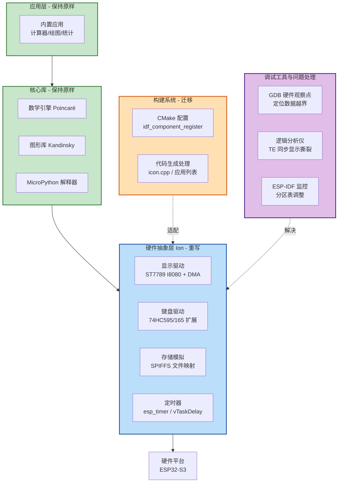

# esp-numworks
This is numworks caculation porting on esp32s3 device


# NumWorks 移植到 ESP32-S3

[](LICENSE)
[](https://www.espressif.com/en/products/socs/esp32-s3)

本项目将 NumWorks 图形计算器的操作系统（Epsilon）成功移植到 **ESP32-S3** 平台，在保留原软件完整功能的同时，充分利用 ESP32-S3 的无线连接能力，为传统计算器拓展了新的可能性。

> 本项目基于 [NumWorks 开源固件](https://github.com/numworks/epsilon) 进行移植开发，完整技术细节可参考系列文章：[NumWorks 移植到 ESP32-S3 全局概述](https://blog.csdn.net/g821254445/article/details/158920349)

## 📖 项目简介

NumWorks 是一款开源图形计算器，其软件 Epsilon 采用模块化设计。ESP32-S3 是乐鑫推出的高性能 Wi-Fi + BLE 物联网芯片。本移植项目的主要目标包括：

- 保持原版 NumWorks 的用户体验和完整功能
- 适配 ESP32-S3 的硬件特性（I8080 并口 LCD、矩阵键盘、持久化存储）
- 将构建系统从 Makefile 迁移至 **ESP-IDF (CMake)**
- 为后续无线功能扩展奠定基础

## 🏗️ 系统架构




**图注说明**

- **绿色模块**：基本保持 NumWorks 原有代码，无需改动。

- **蓝色模块**：针对 ESP32-S3 重新实现的硬件抽象层（Ion），包含显示、键盘、存储、定时器等具体驱动。

- **橙色模块**：构建系统从 Makefile 迁移至 CMake，并处理自动代码生成问题。

- **紫色模块**：调试过程中使用的关键工具及解决典型问题的方法。

  

- ## 🔄 移植流程

  整个移植工作划分为四个阶段，每个阶段的核心任务如下：

  ```mermaid
  flowchart TD
      Start([开始]) --> Step1[准备阶段<br>搭建ESP-IDF环境<br>获取NumWorks源码]
      Step1 --> Step2[硬件抽象层重写<br>显示/键盘/存储/定时器]
      Step2 --> Step3[核心库与构建适配<br>迁移至CMake<br>解决编译兼容性问题]
      Step3 --> Step4[集成调试与优化<br>分区表调整<br>内存问题定位<br>图形接口完善]
      Step4 --> End([稳定运行版本])
      
      Step2 -.-> Challenge1[显示撕裂 → TE引脚同步]
      Step2 -.-> Challenge2[GPIO不足 → 串行扩展芯片]
      Step2 -.-> Challenge3[持久化 → SPIFFS文件映射]
      Step3 -.-> Challenge4[命名冲突 → #undef I / 显式转换]
      Step4 -.-> Challenge5[数据损坏 → GDB硬件观察点]
  ```

  🚀 快速开始

  ### 1. 环境准备

  - 操作系统：Ubuntu 20.04+ / macOS / Windows (WSL2)
  - ESP-IDF：v5.0 或更高版本（[安装指南](https://docs.espressif.com/projects/esp-idf/zh_CN/latest/esp32s3/get-started/)）
  - 工具链：已随 ESP-IDF 安装

  bash

  ```
  # 克隆本仓库
  git clone https://github.com/jojo240607/esp-numworks.git
  cd numworks-esp32s3
  
  # 设置 ESP-IDF 环境（请根据实际安装路径调整）
  . $HOME/esp/esp-idf/export.sh
  ```

  

  ### 2. 配置与构建

  bash

  ```
  # 选择目标芯片
  idf.py set-target esp32s3
  
  # 进入配置菜单（可按需调整分区表等）
  idf.py menuconfig
  
  # 编译固件
  idf.py build
  ```

  

  编译成功后，固件位于 `build/numworks_esp32s3.bin`。

  ### 3. 烧录与监控

  bash

  ```
  # 烧录到设备（需连接 ESP32-S3 开发板）
  idf.py -p /dev/ttyUSB0 flash
  
  # 打开串口监视器
  idf.py -p /dev/ttyUSB0 monitor
  ```

  

  ## 📂 目录结构

  text

  ```
  .
  ├── components/               # ESP-IDF 组件
  │   ├── ion/                  # 硬件抽象层（显示/键盘/存储/定时器）
  │   ├── kandinsky/            # 图形库（基本保持原样）
  │   ├── poincare/             # 数学引擎
  │   ├── python/               # MicroPython 解释器
  │   └── apps/                 # 内置应用
  ├── main/                     # 主入口
  ├── partitions.csv            # 分区表配置
  ├── CMakeLists.txt            # 顶层 CMake 文件
  ├── sdkconfig.defaults        # 默认配置
  └── README.md
  ```

  

  ## 🧪 测试状态

  | 模块        | 状态     | 备注                                   |
  | :---------- | :------- | :------------------------------------- |
  | 显示驱动    | ✅ 通过   | I8080 并口 + DMA，TE 引脚消除撕裂      |
  | 键盘驱动    | ✅ 通过   | 74HC595/165 扩展，完整按键扫描         |
  | 持久化存储  | ✅ 通过   | SPIFFS 分区，记录→文件映射             |
  | 定时器      | ✅ 通过   | 微秒/毫秒级精度                        |
  | 数学引擎    | ✅ 通过   | 完整计算功能                           |
  | Python 引擎 | ✅ 通过   | MicroPython 正常运行                   |
  | 图形界面    | ✅ 通过   | 修复绘图黑边问题                       |
  | 无线功能    | 🚧 规划中 | Wi-Fi/BLE 基础驱动已预留，应用层待开发 |

  ## 🐞 关键问题与解决方案

  移植过程中遇到的主要挑战及解决方式如下：

  | 问题类型     | 具体现象               | 解决方案                                     | 调试工具     |
  | :----------- | :--------------------- | :------------------------------------------- | :----------- |
  | 编译错误     | 模板参数 `I` 与宏冲突  | `#undef I` 或重命名模板参数                  | -            |
  | 类型严格性   | 隐式转换警告/错误      | 添加 `static_cast` 显式转换                  | -            |
  | 内存不足     | 运行随机崩溃           | 调整分区表，增大 `factory` 分区              | ESP-IDF 监控 |
  | 显示撕裂     | 画面上下不同步         | 利用 TE 引脚同步刷新                         | 逻辑分析仪   |
  | 数据损坏     | 存储记录名被篡改       | GDB 硬件观察点定位越界写入                   | GDB          |
  | 负数运算错误 | `-2` 变成 `4294967294` | 修正类型转换（使用 `native_int` 而非无符号） | GDB          |
  | 绘图黑边     | 曲线周围出现黑边       | 完善 `pullRect` 边界裁剪逻辑                 | -            |

  ## 🔮 未来展望

  ESP32-S3 的无线功能为计算器带来了巨大的扩展潜力，后续计划实现：

  - **无线文件传输**：通过 Wi-Fi/蓝牙与电脑/手机连接，实现 Python 脚本、截图等无线传输
  - **OTA 在线更新**：设备端直接下载并安装新版固件
  - **远程协作**：利用蓝牙 HID 实现学生-教师互动
  - **网络访问**：集成 HTTP 客户端，获取在线资源
  - **云存储同步**：跨设备数据备份与同步

  此外，还可以在**性能优化**（脏矩形刷新、SIMD 加速）、**功耗管理**（轻睡眠模式）、**功能完善**（USB 支持、SD 卡扩展）等方面持续改进。

  ## 🤝 贡献指南

  欢迎通过 Issue 和 Pull Request 参与贡献。请确保：

  1. 代码符合 [ESP-IDF 编码规范](https://docs.espressif.com/projects/esp-idf/zh_CN/latest/esp32s3/contribute/style-guide.html)
  2. 提交前进行完整测试（包括显示、键盘、存储等基础功能）
  3. 更新相关文档

  ## 📄 许可证

  本项目基于 [MIT 许可证](https://license/) 开源。NumWorks 原始代码遵循其自有许可证，使用前请仔细阅读。

  ## 📚 参考资料

  - [NumWorks 移植到 ESP32-S3 全局概述](https://blog.csdn.net/g821254445/article/details/158920349)
  - [NumWorks 开源固件仓库](https://github.com/numworks/epsilon)
  - [ESP-IDF 编程指南](https://docs.espressif.com/projects/esp-idf/zh_CN/latest/esp32s3/)
  - [ESP32-S3 技术参考手册](https://www.espressif.com/sites/default/files/documentation/esp32-s3_technical_reference_manual_cn.pdf)
